Stochastic Simulation of the UK’s Disjointed International Teacher
Recruitment: A Model of the Vicious Cycle
================
B Ashiley
2026-04-27

- [Accounting conventions (spend vs waste; year-1
  horizon)](#accounting-conventions-spend-vs-waste-year-1-horizon)

``` r
# ------------------------------------------------------------
# Block 1 — DfE intake: overseas group + subject-group tree
#   Outputs used downstream:
#     - probs_overseas_group      : P(overseas_group | overseas observed, excl Unknown)
#     - probs_subject_by_group    : P(subject_group | overseas_group, excl Unknown)
#     - probs_subject_overseas    : list(overseas_group -> named prob vector)
# ------------------------------------------------------------

file_nat <- "table_10_candidates_subject_by_characteristics.csv"
if (!file.exists(file_nat)) stop("Missing file: ", file_nat)

tbl_nat <- readr::read_csv(file_nat, show_col_types = FALSE)

# Column checks (fail fast if the file schema has changed)
need_cols <- c("itt_subject", "nationality_group", "num_accepted", "sex", "age_grouping", "ethnicity_major")
missing_cols <- setdiff(need_cols, names(tbl_nat))
if (length(missing_cols) > 0) {
  stop("DfE file is missing expected columns: ", paste(missing_cols, collapse = ", "))
}

# Keep totals only to avoid double counting
tbl_nat_clean <- tbl_nat %>%
  dplyr::filter(
    sex == "Total",
    age_grouping == "Total",
    ethnicity_major == "Total",
    nationality_group != "Total"
  ) %>%
  dplyr::select(itt_subject, nationality_group, num_accepted)

# Overseas tagging
tbl_tagged <- tbl_nat_clean %>%
  dplyr::mutate(
    overseas_group = dplyr::case_when(
      nationality_group == "UK and Irish national" ~ "UK_IRL",
      nationality_group == "EEA national" ~ "EU_EEA",
      nationality_group == "Other nationality" ~ "OTHER_OVERSEAS",
      nationality_group == "Unknown" ~ "OVERSEAS_UNKNOWN",
      TRUE ~ "OVERSEAS_UNKNOWN"
    ),
    is_overseas_observed = overseas_group %in% c("EU_EEA", "OTHER_OVERSEAS", "OVERSEAS_UNKNOWN")
  )

# Diagnostic: how much of "overseas observed" is Unknown (reportable)
unknown_check <- tbl_tagged %>%
  dplyr::filter(is_overseas_observed) %>%
  dplyr::summarise(
    overseas_total = sum(num_accepted, na.rm = TRUE),
    overseas_unknown = sum(num_accepted[overseas_group == "OVERSEAS_UNKNOWN"], na.rm = TRUE),
    pct_unknown = 100 * overseas_unknown / overseas_total
  )

# Model estimation excludes Unknown
tbl_overseas_model <- tbl_tagged %>%
  dplyr::filter(is_overseas_observed, overseas_group != "OVERSEAS_UNKNOWN") %>%
  dplyr::mutate(
    subject_group = dplyr::case_when(
      itt_subject == "Physics" ~ "Physics",
      itt_subject == "Modern Foreign Languages" ~ "Modern Languages",
      TRUE ~ "Other"
    )
  )

# P(overseas_group | overseas observed, excl Unknown)
probs_overseas_group <- tbl_overseas_model %>%
  dplyr::group_by(overseas_group) %>%
  dplyr::summarise(n = sum(num_accepted, na.rm = TRUE), .groups = "drop") %>%
  dplyr::mutate(p = n / sum(n)) %>%
  dplyr::select(overseas_group, p) %>%
  tibble::deframe()

assert_prob_vec(as.numeric(probs_overseas_group), "probs_overseas_group")

# P(subject_group | overseas_group), excluding Unknown
probs_subject_by_group <- tbl_overseas_model %>%
  dplyr::group_by(overseas_group, subject_group) %>%
  dplyr::summarise(n = sum(num_accepted, na.rm = TRUE), .groups = "drop") %>%
  dplyr::group_by(overseas_group) %>%
  dplyr::mutate(p = n / sum(n)) %>%
  dplyr::ungroup() %>%
  dplyr::select(overseas_group, subject_group, p) %>%
  dplyr::arrange(overseas_group, dplyr::desc(p))

# Convert to list of named vectors for simulation
probs_subject_overseas <- probs_subject_by_group %>%
  dplyr::group_split(overseas_group) %>%
  rlang::set_names(purrr::map_chr(., ~ unique(.x$overseas_group))) %>%
  purrr::map(~ .x %>% dplyr::select(subject_group, p) %>% tibble::deframe())

# Sanity checks on conditional probability vectors
cond_sums <- purrr::map_dbl(probs_subject_overseas, sum)
if (any(abs(cond_sums - 1) > 1e-8)) {
  stop("Some P(subject_group|overseas_group) vectors do not sum to 1: ",
       paste(names(cond_sums), signif(cond_sums, 8), collapse = "; "))
}

# Clean report tables
tbl_overseas_probs <- tibble::tibble(
  overseas_group = names(probs_overseas_group),
  p = as.numeric(probs_overseas_group)
) %>% dplyr::arrange(dplyr::desc(p))

tbl_subject_probs <- probs_subject_by_group %>%
  dplyr::mutate(p = as.numeric(p)) %>%
  dplyr::arrange(overseas_group, dplyr::desc(p))

tbl_subject_sums <- tbl_subject_probs %>%
  dplyr::group_by(overseas_group) %>%
  dplyr::summarise(sum_p = sum(p), .groups = "drop")

cat("✔ Block 1 complete: overseas_group + subject_group probability tree built\n")
```

    ## ✔ Block 1 complete: overseas_group + subject_group probability tree built

| overseas_total | overseas_unknown | pct_unknown |
|---------------:|-----------------:|------------:|
|          38068 |                8 |        0.02 |

Overseas observed: share of ‘Unknown’ nationality_group (excluded from
modelled probabilities).

| overseas_group |        p |
|:---------------|---------:|
| OTHER_OVERSEAS | 0.620704 |
| EU_EEA         | 0.379296 |

Modelled overseas mix (excluding Unknown): P(overseas_group \| overseas
observed, excl Unknown).

| overseas_group | subject_group    |        p |
|:---------------|:-----------------|---------:|
| EU_EEA         | Other            | 0.904129 |
| EU_EEA         | Modern Languages | 0.089845 |
| EU_EEA         | Physics          | 0.006027 |
| OTHER_OVERSEAS | Other            | 0.903276 |
| OTHER_OVERSEAS | Physics          | 0.069040 |
| OTHER_OVERSEAS | Modern Languages | 0.027684 |

Conditional subject mix (excluding Unknown): P(subject_group \|
overseas_group).

| overseas_group | sum_p |
|:---------------|------:|
| EU_EEA         |     1 |
| OTHER_OVERSEAS |     1 |

Sanity check: sums of P(subject_group \| overseas_group) (should be 1).

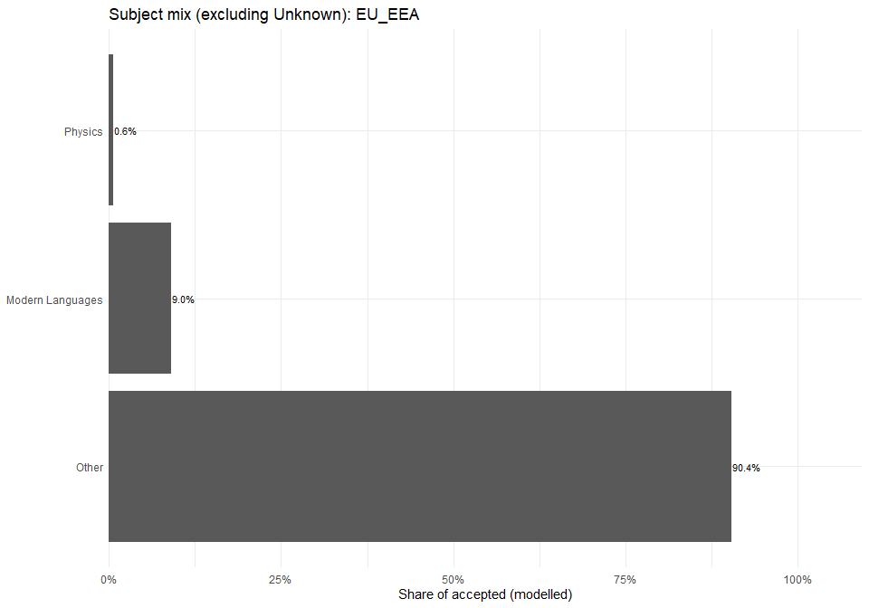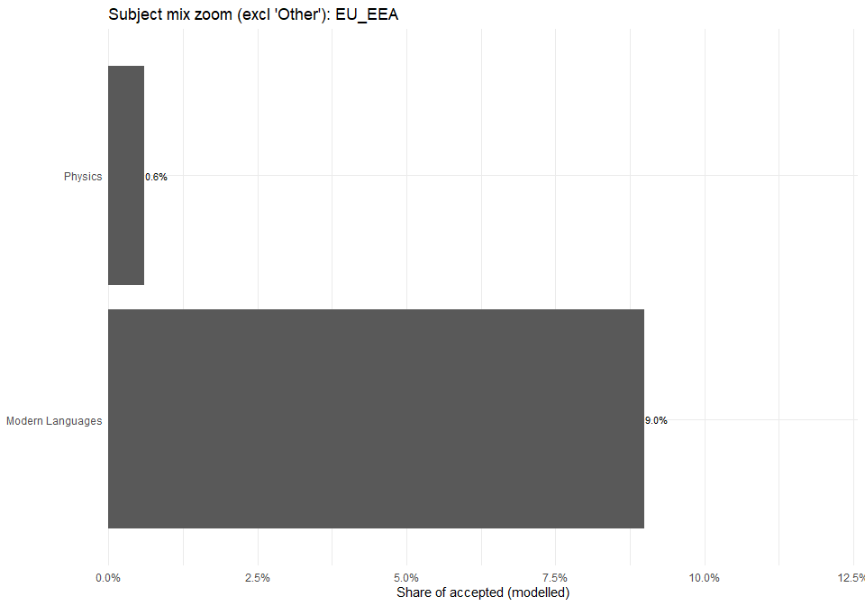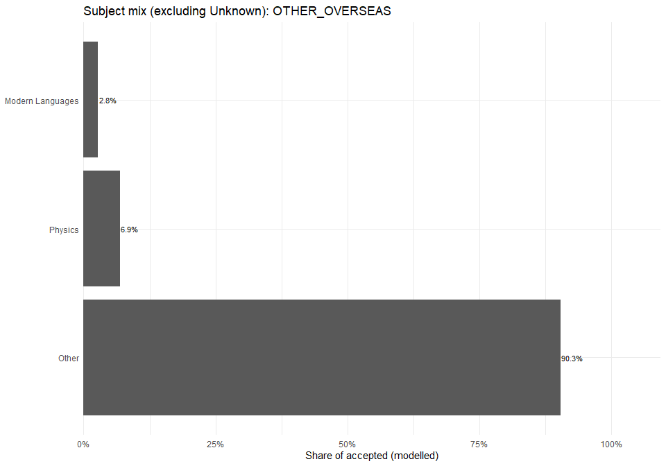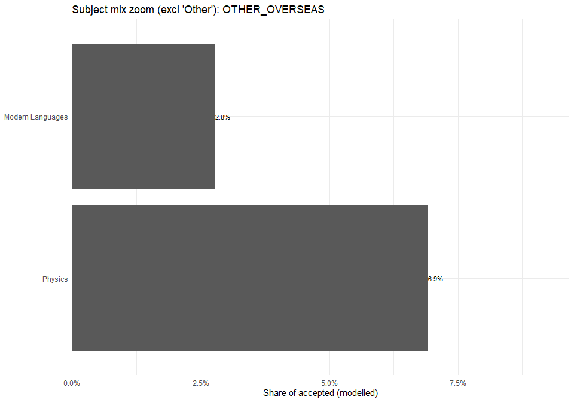

``` r
# ------------------------------------------------------------
# Block 2 — Degree-class probabilities for overseas (pooled)
#   Inputs from Block 1:
#     - probs_overseas_group
#     - probs_subject_overseas
#   Output used downstream:
#     - probs_degree_overseas_all : P(degree_class | Overseas) pooled correctly
# ------------------------------------------------------------

# Fallback (in case Block 0 wasn't run for some reason)
if (!exists("assert_prob_vec")) {
  assert_prob_vec <- function(p, name = "prob") {
    if (any(!is.finite(p))) stop(name, " has non-finite entries.")
    if (any(p < -1e-12)) stop(name, " has negative entries.")
    s <- sum(p)
    if (!is.finite(s) || abs(s - 1) > 1e-8) stop(name, " must sum to 1 (sum=", signif(s, 12), ").")
    invisible(TRUE)
  }
}

file_deg <- "table4.csv"
if (!file.exists(file_deg)) stop("Missing file: ", file_deg)

tbl_degree <- readr::read_csv(file_deg, show_col_types = FALSE)

need_cols_deg <- c("time_period", "breakdown_topic", "breakdown", "itt_subject", "trainee_number")
missing_cols_deg <- setdiff(need_cols_deg, names(tbl_degree))
if (length(missing_cols_deg) > 0) {
  stop("Degree file is missing expected columns: ", paste(missing_cols_deg, collapse = ", "))
}

degree_levels  <- c("First", "Upper Second", "Lower Second", "Other")
subject_groups <- c("Physics", "Modern Languages", "Other")

# Counts by subject_group x degree_class (this is the key step)
deg_group_counts <- tbl_degree %>%
  dplyr::filter(
    time_period == 202526,
    breakdown_topic == "Degree Class",
    breakdown %in% degree_levels
  ) %>%
  dplyr::mutate(
    subject_group = dplyr::case_when(
      itt_subject == "Physics" ~ "Physics",
      itt_subject == "Modern Foreign Languages" ~ "Modern Languages",
      TRUE ~ "Other"
    )
  ) %>%
  dplyr::group_by(subject_group, breakdown) %>%
  dplyr::summarise(n = sum(trainee_number, na.rm = TRUE), .groups = "drop")

# P(degree | subject_group)
p_deg_given_group <- deg_group_counts %>%
  dplyr::group_by(subject_group) %>%
  dplyr::mutate(p = n / sum(n)) %>%
  dplyr::ungroup() %>%
  dplyr::select(subject_group, degree_class = breakdown, p)

# Sanity: each conditional distribution sums to 1
deg_cond_sums <- p_deg_given_group %>%
  dplyr::group_by(subject_group) %>%
  dplyr::summarise(sum_p = sum(p), .groups = "drop")

if (any(abs(deg_cond_sums$sum_p - 1) > 1e-8)) {
  stop("Some P(degree|subject_group) sums are not 1:\n",
       paste(deg_cond_sums$subject_group, signif(deg_cond_sums$sum_p, 10), collapse = "; "))
}

# Mix helper: given P(degree|subject_group) and a subject_group probability vector -> P(degree)
mix_degree_probs <- function(p_deg_given_group, subject_group_probs,
                             subject_groups = c("Physics","Modern Languages","Other"),
                             degree_levels = c("First","Upper Second","Lower Second","Other")) {

  if (any(!subject_groups %in% names(subject_group_probs))) {
    miss <- setdiff(subject_groups, names(subject_group_probs))
    stop("Missing subject_group probabilities: ", paste(miss, collapse = ", "))
  }

  p_sub <- subject_group_probs[subject_groups]
  p_sub <- as.numeric(p_sub)
  names(p_sub) <- subject_groups
  p_sub <- p_sub / sum(p_sub)
  assert_prob_vec(p_sub, "subject_group_probs")

  tmp <- p_deg_given_group %>%
    dplyr::filter(subject_group %in% subject_groups, degree_class %in% degree_levels) %>%
    tidyr::complete(
      subject_group = subject_groups,
      degree_class = degree_levels,
      fill = list(p = 0)
    ) %>%
    dplyr::mutate(
      p_group = p_sub[subject_group],
      weighted = p * p_group
    )

  out <- tmp %>%
    dplyr::group_by(degree_class) %>%
    dplyr::summarise(p = sum(weighted), .groups = "drop") %>%
    dplyr::mutate(p = p / sum(p))

  vec <- out %>% dplyr::select(degree_class, p) %>% tibble::deframe()
  vec <- vec[degree_levels]
  assert_prob_vec(as.numeric(vec), "mixed degree probs")
  vec
}

# Verification: compare EU_EEA vs OTHER_OVERSEAS degree mixes implied by their subject mixes
deg_EU <- mix_degree_probs(p_deg_given_group, probs_subject_overseas$EU_EEA,
                           subject_groups = subject_groups, degree_levels = degree_levels)

deg_OO <- mix_degree_probs(p_deg_given_group, probs_subject_overseas$OTHER_OVERSEAS,
                           subject_groups = subject_groups, degree_levels = degree_levels)

verify_tbl <- tibble::tibble(
  degree_class = degree_levels,
  EU_EEA = as.numeric(deg_EU[degree_levels]),
  OTHER_OVERSEAS = as.numeric(deg_OO[degree_levels]),
  abs_diff = abs(EU_EEA - OTHER_OVERSEAS)
)

verify_summary <- verify_tbl %>%
  dplyr::summarise(
    max_abs_diff = max(abs_diff),
    l1_distance = sum(abs_diff)
  )

# P(subject_group | Overseas) pooled via total probability:
#   sum_g P(subject_group | g) P(g), where g in {EU_EEA, OTHER_OVERSEAS}
if (!all(names(probs_overseas_group) %in% names(probs_subject_overseas))) {
  stop("Mismatch: probs_overseas_group keys are not all present in probs_subject_overseas.")
}

probs_subject_overall_overseas <- setNames(
  vapply(subject_groups, function(sg) {
    sum(vapply(names(probs_overseas_group), function(g) {
      probs_subject_overseas[[g]][sg] * probs_overseas_group[g]
    }, numeric(1)))
  }, numeric(1)),
  subject_groups
)
probs_subject_overall_overseas <- probs_subject_overall_overseas / sum(probs_subject_overall_overseas)
assert_prob_vec(as.numeric(probs_subject_overall_overseas), "probs_subject_overall_overseas")

# P(degree | Overseas) pooled (this is the distribution used in the simulator)
probs_degree_overseas_all <- mix_degree_probs(
  p_deg_given_group,
  probs_subject_overall_overseas,
  subject_groups = subject_groups,
  degree_levels = degree_levels
)

cat("✔ Block 2 complete: pooled overseas degree probabilities ready\n")
```

    ## ✔ Block 2 complete: pooled overseas degree probabilities ready

``` r
print(probs_degree_overseas_all)
```

    ##        First Upper Second Lower Second        Other 
    ##    0.2230514    0.4855497    0.1893497    0.1020492

| subject_group    | breakdown    |     n |
|:-----------------|:-------------|------:|
| Modern Languages | Upper Second |  1098 |
| Modern Languages | First        |   530 |
| Modern Languages | Other        |   342 |
| Modern Languages | Lower Second |   262 |
| Other            | Upper Second | 58548 |
| Other            | First        | 26819 |
| Other            | Lower Second | 22703 |
| Other            | Other        | 10792 |
| Physics          | Upper Second |   562 |
| Physics          | Other        |   448 |
| Physics          | Lower Second |   396 |
| Physics          | First        |   258 |

Degree-class counts by subject group (DfE Table 4).

| subject_group    | degree_class |        p |
|:-----------------|:-------------|---------:|
| Modern Languages | Upper Second | 0.491935 |
| Modern Languages | First        | 0.237455 |
| Modern Languages | Other        | 0.153226 |
| Modern Languages | Lower Second | 0.117384 |
| Other            | Upper Second | 0.492571 |
| Other            | First        | 0.225631 |
| Other            | Lower Second | 0.191003 |
| Other            | Other        | 0.090794 |
| Physics          | Upper Second | 0.337740 |
| Physics          | Other        | 0.269231 |
| Physics          | Lower Second | 0.237981 |
| Physics          | First        | 0.155048 |

Conditional degree distribution: P(degree_class \| subject_group).

| degree_class |   EU_EEA | OTHER_OVERSEAS | abs_diff |
|:-------------|---------:|---------------:|---------:|
| First        | 0.226268 |       0.221086 | 0.005183 |
| Upper Second | 0.491581 |       0.481864 | 0.009717 |
| Lower Second | 0.184672 |       0.192208 | 0.007536 |
| Other        | 0.097479 |       0.104842 | 0.007363 |

Verification: implied degree mix by overseas group (differences should
be small).

| max_abs_diff | l1_distance |
|-------------:|------------:|
|     0.009717 |    0.029799 |

Verification summary: maximum absolute difference and L1 distance.

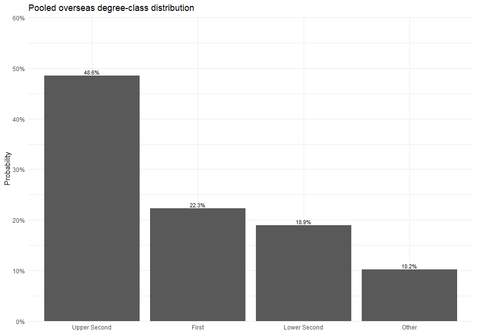

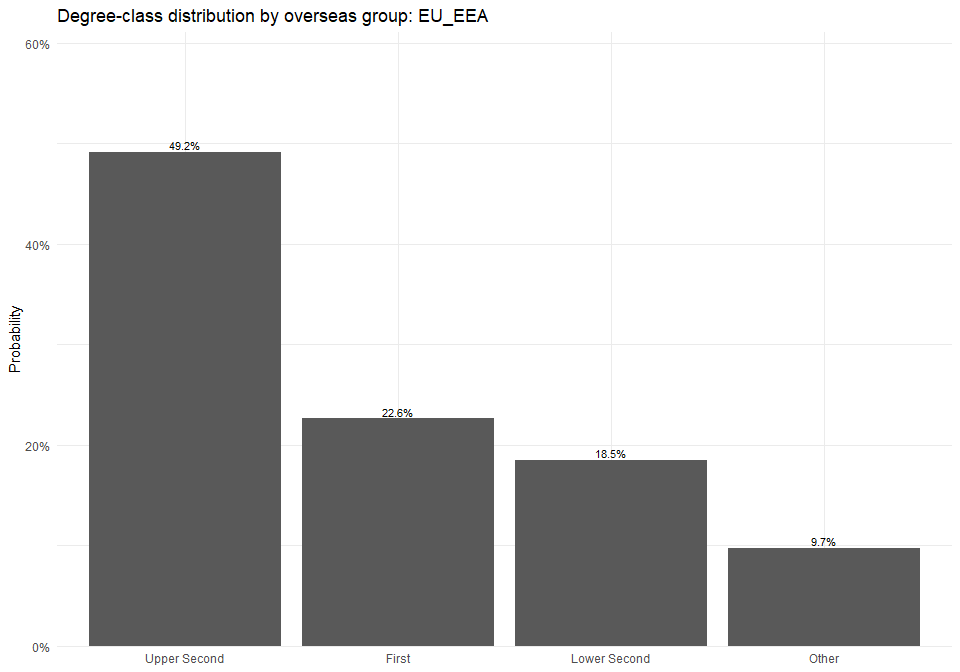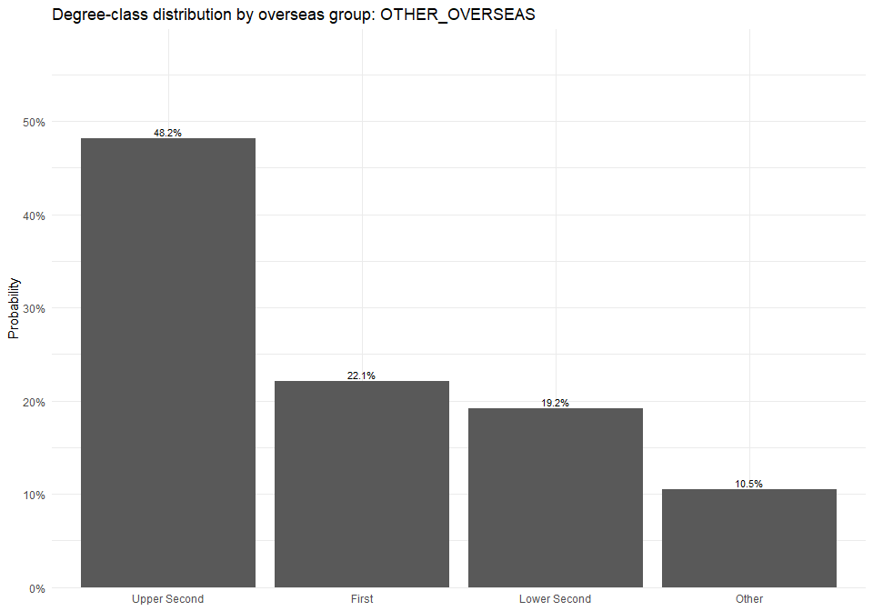

``` r
# ------------------------------------------------------------
# Block 3 — Policy layer + core simulation engine
#   Inputs from Block 1–2:
#     - probs_overseas_group
#     - probs_subject_overseas
#     - probs_degree_overseas_all
#   Outputs for Block 4:
#     - policy_A, policy_B, policy_C
#     - generate_potential_overseas(), add_training_and_offers(),
#       assign_training_incentives(), apply_policy_and_score()
# ------------------------------------------------------------

# Minimal guardrails (in case Block 0 wasn't run)
if (!exists("assert_prob_vec")) {
  assert_prob_vec <- function(p, name = "prob") {
    if (any(!is.finite(p))) stop(name, " has non-finite entries.")
    if (any(p < -1e-12)) stop(name, " has negative entries.")
    s <- sum(p)
    if (!is.finite(s) || abs(s - 1) > 1e-8) stop(name, " must sum to 1 (sum=", signif(s, 12), ").")
    invisible(TRUE)
  }
}

# -----------------------------
# 3.0 Core parameters
# -----------------------------

# EU/EEA: probability they already have a status (no visa needed)
p_eu_has_euss <- 0.60

# Visa costs counted upfront for year-1 accounting
visa_years_upfront <- 3

# Narrative horizon (not charged upfront here)
years_to_settlement <- 5

# IHS and Skilled Worker fees (use your report's chosen numbers)
ihs_per_year <- 1035
visa_fee_sw_leq3 <- 769
visa_fee_sw_gt3  <- 1519

# School sponsorship costs (Certificate of Sponsorship + Immigration Skills Charge)
cos_fee <- 525
isc_per_year <- 364

# Fallback only (kept for interim compatibility; main engine will compute from policy below)
cost_school_sponsorship <- cos_fee + isc_per_year * visa_years_upfront

calc_school_sponsorship_cost <- function(policy, params) {
  yrs <- policy$visa_years_upfront
  if (is.null(yrs) || !is.finite(yrs)) {
    warning("Policy missing visa_years_upfront; falling back to global/default for sponsorship costing.")
    yrs <- params$visa_years_upfront
  }
  params$cos_fee + params$isc_per_year * yrs
}

# Training incentives (toggle if you want the non-UK line for MFL)
use_nonuk_training_support <- TRUE

bursary_physics     <- 29000
scholarship_physics <- 31000

# ------------------------------------------------------------
# Modern Languages incentives — bursary-only (disable scholarships)
# Rationale: official language scholarships are restricted (e.g., F/G/S only);
# if the model does not split Modern Languages into eligible subtypes,
# we disable scholarships to avoid over-claiming.
# ------------------------------------------------------------

if (use_nonuk_training_support) {
  bursary_languages     <- 20000
  scholarship_languages <- 22000  # kept for reference; NOT USED when prob = 0
} else {
  bursary_languages     <- 26000
  scholarship_languages <- 28000  # kept for reference; NOT USED when prob = 0
}

prob_scholarship_physics   <- 0.15
# Hard-disable Modern Languages scholarships in the awarding mechanism
prob_scholarship_languages <- 0

# Relocation support (DfE)
relocation_support_amount <- 10000
relocation_subjects <- c("Physics", "Modern Languages")  # set to NULL to apply to all visa-friction recruits

# Capacity constraint (posts available)
capacity_posts <- 1200

# Integration course (school cost, visa-friction recruits only)
integration_course_cost_per_trainee <- 400

# "Exceptional" marker for scholarship eligibility proxy
prob_exceptional <- 0.15

# Retention baselines
retention_baseline_no_visa     <- 0.78
retention_baseline_visa_noR    <- 0.60
retention_baseline_visa_withR  <- 0.75
integration_boost_visa <- 0.06

# Consolidate core constants (used to remove globals inside functions later)
params <- list(
  p_eu_has_euss = p_eu_has_euss,
  visa_years_upfront = visa_years_upfront,
  years_to_settlement = years_to_settlement,
  ihs_per_year = ihs_per_year,
  visa_fee_sw_leq3 = visa_fee_sw_leq3,
  visa_fee_sw_gt3  = visa_fee_sw_gt3,
  cos_fee = cos_fee,
  isc_per_year = isc_per_year,
  use_nonuk_training_support = use_nonuk_training_support,
  bursary_physics = bursary_physics,
  scholarship_physics = scholarship_physics,
  bursary_languages = bursary_languages,
  scholarship_languages = scholarship_languages,
  prob_scholarship_physics = prob_scholarship_physics,
  prob_scholarship_languages = prob_scholarship_languages,
  relocation_support_amount = relocation_support_amount,
  relocation_subjects = relocation_subjects,
  capacity_posts = capacity_posts,
  integration_course_cost_per_trainee = integration_course_cost_per_trainee,
  prob_exceptional = prob_exceptional,
  retention_baseline_no_visa = retention_baseline_no_visa,
  retention_baseline_visa_noR = retention_baseline_visa_noR,
  retention_baseline_visa_withR = retention_baseline_visa_withR,
  integration_boost_visa = integration_boost_visa
)
params$prob_scholarship_languages <- 0


# -----------------------------
# 3.1 Policy scenarios (A/B/C)
# -----------------------------

policy_A <- list(
  name = "Status Quo (S=0.40, R=0, I=0)",
  prob_sponsor = 0.40,
  visa_years_upfront = visa_years_upfront,
  years_to_settlement = years_to_settlement,
  ihs_per_year = ihs_per_year,
  visa_fee_sw_leq3 = visa_fee_sw_leq3,
  visa_fee_sw_gt3  = visa_fee_sw_gt3,
  relocation_support = 0,
  retention_baseline_no_visa = retention_baseline_no_visa,
  retention_baseline_visa    = retention_baseline_visa_noR,
  integration_coverage = 0.00,
  integration_boost_visa = 0.00
)

policy_B <- list(
  name = "Auto Sponsor + Relocation (S=1.00, R=1, I=0)",
  prob_sponsor = 1.00,
  visa_years_upfront = visa_years_upfront,
  years_to_settlement = years_to_settlement,
  ihs_per_year = ihs_per_year,
  visa_fee_sw_leq3 = visa_fee_sw_leq3,
  visa_fee_sw_gt3  = visa_fee_sw_gt3,
  relocation_support = relocation_support_amount,
  retention_baseline_no_visa = retention_baseline_no_visa,
  retention_baseline_visa    = retention_baseline_visa_withR,
  integration_coverage = 0.00,
  integration_boost_visa = 0.00
)

policy_C <- list(
  name = "Auto Sponsor + Relocation + Integration (S=1.00, R=1, I=1)",
  prob_sponsor = 1.00,
  visa_years_upfront = visa_years_upfront,
  years_to_settlement = years_to_settlement,
  ihs_per_year = ihs_per_year,
  visa_fee_sw_leq3 = visa_fee_sw_leq3,
  visa_fee_sw_gt3  = visa_fee_sw_gt3,
  relocation_support = relocation_support_amount,
  retention_baseline_no_visa = retention_baseline_no_visa,
  retention_baseline_visa    = retention_baseline_visa_withR,
  integration_coverage = 1.00,
  integration_boost_visa = integration_boost_visa
)

cat("✔ Block 3 parameters + policies defined\n")
```

    ## ✔ Block 3 parameters + policies defined

## Accounting conventions (spend vs waste; year-1 horizon)

**Horizon.** All accounting is reported on a **year-1 horizon**.
“Retained (year 1)” means recruited and still in post at the end of
year 1. Any trainee/teacher who leaves by end of year 1 is treated as a
year-1 loss.

**DfE (public) spend.** - **Spend** includes: training incentives
awarded at training stage (**bursary/scholarship**) plus any
**relocation support** paid to eligible recruited trainees. - **Waste**
includes: - bursary/scholarship paid to trainees who **do not become
recruited** or who **leave by end of year 1**; and - relocation support
paid to recruits who **leave by end of year 1**. - Rationale:
bursaries/scholarships are policy spend intended to increase the supply
of retained teachers; if that conversion fails within the year-1 window,
the spend is counted as wasted for this horizon.

**School (provider/employer) spend.** - **Spend** includes: sponsorship
cost (CoS + ISC) for recruited visa-exposed teachers, plus any
integration course cost for those assigned the course. - **Waste**
includes school spend attached to recruited teachers who **leave by end
of year 1**.

**Teacher (private) spend.** - **Spend** includes: upfront visa/IHS
costs borne by the teacher **net of any relocation support** (i.e.,
out-of-pocket after relocation offsets). - **Waste** includes teacher
net spend attached to recruited teachers who **leave by end of year 1**.

``` r
# -----------------------------
# 3.2 Simulation helpers
# -----------------------------

inv_logit <- function(x) 1 / (1 + exp(-x))

sample_cat <- function(n, prob_vec) {
  assert_prob_vec(as.numeric(prob_vec), "prob_vec")
  sample(names(prob_vec), n, replace = TRUE, prob = prob_vec)
}

# 3.2.1 Generate potential overseas candidates (accepted to ITT)
generate_potential_overseas <- function(
  n,
  probs_overseas_group,
  probs_subject_overseas,
  probs_degree_overseas_all,
  p_eu_has_euss,
  prob_exceptional
) {
  assert_prob_vec(as.numeric(probs_overseas_group), "probs_overseas_group")
  assert_prob_vec(as.numeric(probs_degree_overseas_all), "probs_degree_overseas_all")
  if (!all(c("EU_EEA","OTHER_OVERSEAS") %in% names(probs_subject_overseas))) {
    stop("probs_subject_overseas must include EU_EEA and OTHER_OVERSEAS.")
  }

  overseas_group <- sample_cat(n, probs_overseas_group)

  needs_visa <- dplyr::case_when(
    overseas_group == "EU_EEA" ~ (runif(n) > p_eu_has_euss),
    overseas_group == "OTHER_OVERSEAS" ~ TRUE,
    TRUE ~ TRUE
  )

  subject <- character(n)
  idx_eu <- which(overseas_group == "EU_EEA")
  idx_oo <- which(overseas_group == "OTHER_OVERSEAS")

  if (length(idx_eu) > 0) subject[idx_eu] <- sample_cat(length(idx_eu), probs_subject_overseas$EU_EEA)
  if (length(idx_oo) > 0) subject[idx_oo] <- sample_cat(length(idx_oo), probs_subject_overseas$OTHER_OVERSEAS)

  degree_class <- sample_cat(n, probs_degree_overseas_all)

  tibble::tibble(
    id = seq_len(n),
    overseas_group = overseas_group,
    needs_visa = needs_visa,
    subject = subject,
    degree_class = degree_class,
    has_exceptional_qual = (rbinom(n, 1, prob_exceptional) == 1),
    induction_quality = runif(n)
  )
}

# 3.2.2 Training completion/QTS gate + capacity-limited offers
add_training_and_offers <- function(
  df_potential,
  capacity_posts,
  shortage_subjects = c("Physics","Modern Languages"),
  u_qual = NULL,
  seed_offer = NULL
) {
  df <- df_potential %>%
    dplyr::mutate(
      degree_simple = dplyr::case_when(
        degree_class == "First" ~ "First",
        degree_class == "Upper Second" ~ "Upper Second",
        degree_class == "Lower Second" ~ "Lower Second",
        TRUE ~ "Other"
      )
    )

  n <- nrow(df)
  if (is.null(u_qual)) u_qual <- runif(n)
  if (length(u_qual) != n) stop("u_qual must have length nrow(df_potential).")

  beta_degree <- c("First"=0.55, "Upper Second"=0.30, "Lower Second"=0.10, "Other"=0.00)
  deg_eff <- unname(beta_degree[df$degree_simple]); deg_eff[is.na(deg_eff)] <- 0

  p_qualified <- inv_logit(-0.25 + 1.10*df$induction_quality + 0.50*as.numeric(df$has_exceptional_qual) + deg_eff)
  qualified <- (u_qual < p_qualified)

  offer_bonus <- c("First"=0.35, "Upper Second"=0.20, "Lower Second"=0.05, "Other"=0.00)
  deg_bonus <- unname(offer_bonus[df$degree_simple]); deg_bonus[is.na(deg_bonus)] <- 0
  offer_weight <- 1.0 + if_else(df$subject %in% shortage_subjects, 0.8, 0) + deg_bonus

  offer <- rep(FALSE, n)
  idx <- which(qualified)
  K <- min(capacity_posts, length(idx))

  restore_seed <- NULL
  if (!is.null(seed_offer)) {
    if (exists(".Random.seed", envir = .GlobalEnv, inherits = FALSE)) {
      restore_seed <- get(".Random.seed", envir = .GlobalEnv)
    }
    set.seed(seed_offer)
  }

  if (K > 0) {
    winners <- sample(idx, size = K, replace = FALSE, prob = pmax(offer_weight[idx], 1e-6))
    offer[winners] <- TRUE
  }

  if (!is.null(seed_offer)) {
    if (is.null(restore_seed)) {
      if (exists(".Random.seed", envir = .GlobalEnv, inherits = FALSE)) rm(".Random.seed", envir = .GlobalEnv)
    } else {
      assign(".Random.seed", restore_seed, envir = .GlobalEnv)
    }
  }

  df %>%
    dplyr::mutate(
      p_qualified = p_qualified,
      qualified = qualified,
      offer_weight = offer_weight,
      offered = offer
    )
}

# 3.2.3 Assign bursary/scholarship at training stage
assign_training_incentives <- function(df_in, params = params) {
  if (is.null(params)) stop("assign_training_incentives(): params must be provided.")

  df <- df_in %>%
    dplyr::mutate(
      bursary_eligible = subject %in% c("Physics","Modern Languages") &
        degree_simple %in% c("First","Upper Second","Lower Second"),

      scholarship_eligible = subject %in% c("Physics","Modern Languages") &
        (degree_simple %in% c("First","Upper Second") |
           (degree_simple == "Lower Second" & has_exceptional_qual)),

      scholarship_weight = dplyr::case_when(
        degree_simple == "First" ~ 3,
        degree_simple == "Upper Second" ~ 2,
        degree_simple == "Lower Second" ~ 1,
        TRUE ~ 0
      ) + 0.001
    )

  award_weighted_binom <- function(df0, subj, p_award) {
    idx <- which(df0$subject == subj & df0$scholarship_eligible)
    out <- rep(FALSE, nrow(df0))
    if (length(idx) == 0) return(out)

    K <- rbinom(1, size = length(idx), prob = p_award)
    if (K <= 0) return(out)

    winners <- sample(idx, size = min(K, length(idx)), replace = FALSE, prob = df0$scholarship_weight[idx])
    out[winners] <- TRUE
    out
  }

  sch_award <- rep(FALSE, nrow(df))
  sch_award <- sch_award | award_weighted_binom(df, "Physics", params$prob_scholarship_physics)
  sch_award <- sch_award | award_weighted_binom(df, "Modern Languages", params$prob_scholarship_languages)

  df %>%
    dplyr::mutate(
      scholarship_awarded = sch_award,
      incentive_type = dplyr::case_when(
        scholarship_awarded ~ "Scholarship",
        bursary_eligible ~ "Bursary",
        TRUE ~ "None"
      ),
      incentive_value = dplyr::case_when(
        subject == "Physics" & incentive_type == "Scholarship" ~ params$scholarship_physics,
        subject == "Physics" & incentive_type == "Bursary" ~ params$bursary_physics,
        subject == "Modern Languages" & incentive_type == "Scholarship" ~ params$scholarship_languages,
        subject == "Modern Languages" & incentive_type == "Bursary" ~ params$bursary_languages,
        TRUE ~ 0
      )
    )
}

# 3.2.4 Apply policy after offers exist + year-1 retention + spend/waste accounting
apply_policy_and_score <- function(
  df_pipeline,
  policy,
  cost_school_sponsorship = NULL,  # legacy arg kept for compatibility; policy-derived cost is used
  relocation_subjects = c("Physics","Modern Languages"),
  u_integration = NULL,
  u_sponsor = NULL,
  u_retention = NULL,
  params = params
) {
  if (is.null(params)) stop("apply_policy_and_score(): params must be provided.")

  df <- df_pipeline
  n <- nrow(df)

  if (is.null(u_integration)) u_integration <- runif(n)
  if (is.null(u_sponsor))     u_sponsor     <- runif(n)
  if (is.null(u_retention))   u_retention   <- runif(n)

  if (length(u_integration) != n) stop("u_integration length mismatch.")
  if (length(u_sponsor) != n) stop("u_sponsor length mismatch.")
  if (length(u_retention) != n) stop("u_retention length mismatch.")

  sponsored <- df$offered & df$needs_visa & (u_sponsor < policy$prob_sponsor)
  recruited <- df$offered & (!df$needs_visa | sponsored)

  visa_fee_sw <- if (policy$visa_years_upfront <= 3) policy$visa_fee_sw_leq3 else policy$visa_fee_sw_gt3
  upfront_cost_gross <- if_else(
    recruited & df$needs_visa,
    visa_fee_sw + policy$ihs_per_year * policy$visa_years_upfront,
    0
  )

  relocation_eligible <- if (is.null(relocation_subjects)) {
    recruited & df$qualified & df$needs_visa
  } else {
    recruited & df$qualified & df$needs_visa & (df$subject %in% relocation_subjects)
  }
  relocation_paid <- if_else(relocation_eligible, policy$relocation_support, 0)
  upfront_cost_net_teacher <- pmax(0, upfront_cost_gross - relocation_paid)

  integration_course <- recruited & df$needs_visa & (u_integration < policy$integration_coverage)
  school_integration_spend <- params$integration_course_cost_per_trainee * as.numeric(integration_course)

  # Policy-dependent sponsorship unit cost
  sponsor_unit_cost <- calc_school_sponsorship_cost(policy, params)
  school_sponsorship_spend <- sponsor_unit_cost * as.numeric(recruited & df$needs_visa)

  base_retention <- dplyr::case_when(
    !recruited ~ NA_real_,
    recruited & !df$needs_visa ~ pmin(1, policy$retention_baseline_no_visa + 0.20 * df$induction_quality),
    recruited & df$needs_visa  ~ pmin(1, policy$retention_baseline_visa    + 0.35 * df$induction_quality)
  )
  integration_boost <- if_else(recruited & df$needs_visa & integration_course, policy$integration_boost_visa, 0)
  retention_prob <- if_else(!recruited, NA_real_, pmin(1, base_retention + integration_boost))

  retained_year_1 <- if_else(recruited, (u_retention < retention_prob), NA)
  left_year_1 <- recruited & !retained_year_1

  # Spend (year-1 horizon)
  dfe_spend <- df$incentive_value + relocation_paid
  school_spend <- school_sponsorship_spend + school_integration_spend
  teacher_spend <- upfront_cost_net_teacher

  # Waste components (year-1)
  dfe_incentive_waste <- if_else(df$incentive_value > 0 & (!recruited | left_year_1), df$incentive_value, 0)
  dfe_relocation_waste <- if_else(left_year_1, relocation_paid, 0)

  school_sponsorship_waste <- if_else(left_year_1 & recruited & df$needs_visa, sponsor_unit_cost, 0)
  school_integration_waste <- if_else(left_year_1, school_integration_spend, 0)

  teacher_money_wasted <- if_else(left_year_1, upfront_cost_net_teacher, 0)

  df_out <- df %>%
    dplyr::mutate(
      sponsored = sponsored,
      recruited = recruited,
      retention_prob = retention_prob,
      retained_year_1 = retained_year_1,
      left_year_1 = left_year_1,
      relocation_eligible = relocation_eligible,
      relocation_paid = relocation_paid,
      upfront_cost_gross = upfront_cost_gross,
      upfront_cost_net_teacher = upfront_cost_net_teacher,
      integration_course = integration_course,
      school_integration_spend = school_integration_spend,
      school_sponsorship_spend = school_sponsorship_spend,
      dfe_spend = dfe_spend,
      school_spend = school_spend,
      teacher_spend = teacher_spend,
      dfe_waste = dfe_incentive_waste + dfe_relocation_waste,
      school_waste = school_sponsorship_waste + school_integration_waste,
      teacher_waste = teacher_money_wasted
    )

  summary <- df_out %>%
    dplyr::summarise(
      policy = policy$name,
      n_potential = n(),
      n_qualified = sum(qualified),
      n_offered = sum(offered),
      n_recruited = sum(recruited),
      n_sponsored = sum(sponsored),

      # recruitment_rate = recruited share (of simulated accepted cohort)
      recruitment_rate = mean(recruited),

      attrition_rate_year1 = if_else(sum(recruited) > 0, mean(!retained_year_1[recruited]), NA_real_),
      share_needs_visa_among_recruited = if_else(sum(recruited) > 0, mean(needs_visa[recruited]), NA_real_),
      share_integration_among_recruited_needs_visa = if_else(
        sum(recruited & needs_visa) > 0,
        mean(integration_course[recruited & needs_visa]),
        NA_real_
      ),

      total_dfe_spend = sum(dfe_spend),
      total_dfe_waste = sum(dfe_waste),
      total_dfe_waste_visa_only = sum(dfe_waste[needs_visa], na.rm = TRUE),
      total_dfe_waste_nonvisa   = sum(dfe_waste[!needs_visa], na.rm = TRUE),

      total_school_spend = sum(school_spend),
      total_school_waste = sum(school_waste),

      total_teacher_spend = sum(teacher_spend),
      total_teacher_waste = sum(teacher_waste),

      total_relocation_spend = sum(relocation_paid),
      relocation_spend_wasted = sum(if_else(left_year_1, relocation_paid, 0)),
      .groups = "drop"
    ) %>%
    dplyr::mutate(
      dfe_waste_rate = if_else(total_dfe_spend > 0, total_dfe_waste / total_dfe_spend, NA_real_),
      school_waste_rate = if_else(total_school_spend > 0, total_school_waste / total_school_spend, NA_real_),
      teacher_waste_rate = if_else(total_teacher_spend > 0, total_teacher_waste / total_teacher_spend, NA_real_),

      recruited_over_capacity = n_recruited / params$capacity_posts,
      recruited_over_qualified = if_else(n_qualified > 0, n_recruited / n_qualified, NA_real_)
    )

  list(df = df_out, summary = summary)
}

cat("✔ Block 3 functions loaded\n")
```

    ## ✔ Block 3 functions loaded

    ## ✔ Fast inner-loop functions sourced

``` r
# -----------------------------
# 3.3 Single run sanity checks + clean summary tables
# -----------------------------

set.seed(2025)
N0 <- 2000

potential <- generate_potential_overseas(
  n = N0,
  probs_overseas_group = probs_overseas_group,
  probs_subject_overseas = probs_subject_overseas,
  probs_degree_overseas_all = probs_degree_overseas_all,
  p_eu_has_euss = params$p_eu_has_euss,
  prob_exceptional = params$prob_exceptional
)

# Sanity: implied vs simulated visa-friction share
implied_needs_visa <- as.numeric(probs_overseas_group["OTHER_OVERSEAS"]) +
  as.numeric(probs_overseas_group["EU_EEA"]) * (1 - params$p_eu_has_euss)

sanity_visa <- tibble::tibble(
  implied_needs_visa = implied_needs_visa,
  simulated_needs_visa = mean(potential$needs_visa)
)

pipeline <- potential %>%
  add_training_and_offers(
    df_potential = .,
    capacity_posts = params$capacity_posts,
    u_qual = runif(nrow(potential)),
    seed_offer = 777
  ) %>%
  assign_training_incentives(params = params)

# Common random numbers (fixed across policies for this pipeline)
u_sponsor_all <- runif(nrow(pipeline))
u_retention_all <- runif(nrow(pipeline))
u_integration_all <- runif(nrow(pipeline))

# A/B/C (same pipeline + same CRN)
res_A <- apply_policy_and_score(
  df_pipeline = pipeline,
  policy = policy_A,
  relocation_subjects = params$relocation_subjects,
  u_integration = u_integration_all,
  u_sponsor = u_sponsor_all,
  u_retention = u_retention_all,
  params = params
)
res_B <- apply_policy_and_score(
  df_pipeline = pipeline,
  policy = policy_B,
  relocation_subjects = params$relocation_subjects,
  u_integration = u_integration_all,
  u_sponsor = u_sponsor_all,
  u_retention = u_retention_all,
  params = params
)
res_C <- apply_policy_and_score(
  df_pipeline = pipeline,
  policy = policy_C,
  relocation_subjects = params$relocation_subjects,
  u_integration = u_integration_all,
  u_sponsor = u_sponsor_all,
  u_retention = u_retention_all,
  params = params
)

abc_tbl <- dplyr::bind_rows(res_A$summary, res_B$summary, res_C$summary) %>%
  dplyr::mutate(
    total_system_waste = total_dfe_waste + total_school_waste + total_teacher_waste,
    retained_year1 = n_recruited * (1 - attrition_rate_year1),
    waste_per_retained = total_system_waste / pmax(retained_year1, 1)
  )

# 2x2 for sponsorship regimes (same pipeline + same CRN)
retention_visa_noR <- policy_A$retention_baseline_visa
retention_visa_withR <- policy_B$retention_baseline_visa
relocation_amount <- policy_B$relocation_support
integration_boost <- policy_C$integration_boost_visa

make_2x2 <- function(prob_sponsor_fixed, label_prefix) {
  base <- modifyList(policy_A, list(
    name = paste0(label_prefix, " None (R=0, I=0)"),
    prob_sponsor = prob_sponsor_fixed,
    relocation_support = 0,
    retention_baseline_visa = retention_visa_noR,
    integration_coverage = 0,
    integration_boost_visa = 0
  ))
  R_only <- modifyList(base, list(
    name = paste0(label_prefix, " Relocation only (R=1, I=0)"),
    relocation_support = relocation_amount,
    retention_baseline_visa = retention_visa_withR
  ))
  I_only <- modifyList(base, list(
    name = paste0(label_prefix, " Integration only (R=0, I=1)"),
    integration_coverage = 1.0,
    integration_boost_visa = integration_boost
  ))
  R_I <- modifyList(base, list(
    name = paste0(label_prefix, " Relocation + Integration (R=1, I=1)"),
    relocation_support = relocation_amount,
    retention_baseline_visa = retention_visa_withR,
    integration_coverage = 1.0,
    integration_boost_visa = integration_boost
  ))
  list(base, R_only, I_only, R_I)
}

run_policy_list <- function(policy_list) {
  purrr::map_dfr(policy_list, function(pol) {
    apply_policy_and_score(
      df_pipeline = pipeline,
      policy = pol,
      relocation_subjects = params$relocation_subjects,
      u_integration = u_integration_all,
      u_sponsor = u_sponsor_all,
      u_retention = u_retention_all,
      params = params
    )$summary
  }) %>%
    dplyr::mutate(
      total_system_waste = total_dfe_waste + total_school_waste + total_teacher_waste
    )
}

tbl_2x2_SQ <- run_policy_list(make_2x2(0.40, "S=0.40 |"))
tbl_2x2_AS <- run_policy_list(make_2x2(1.00, "S=1.00 |"))

cat("✔ Block 3 single-run objects ready: sanity_visa, abc_tbl, tbl_2x2_SQ, tbl_2x2_AS\n")
```

    ## ✔ Block 3 single-run objects ready: sanity_visa, abc_tbl, tbl_2x2_SQ, tbl_2x2_AS

| implied_needs_visa | simulated_needs_visa |
|-------------------:|---------------------:|
|             0.7724 |                0.757 |

Sanity check: implied vs simulated visa-friction share (single run).

| Policy | Recruited | Recruited share (of simulated accepted cohort) | Recruited / capacity | Recruited / qualified | Attrition (yr1) | Needs-visa share (recruited) | Integration share (visa-recruited) | Retained (yr1) |
|:---|---:|---:|---:|---:|---:|---:|---:|---:|
| Status Quo (S=0.40, R=0, I=0) | 647 | 0.3235 | 0.5392 | 0.4854 | 0.1515 | 0.5162 | 0 | 549 |
| Auto Sponsor + Relocation (S=1.00, R=1, I=0) | 1200 | 0.6000 | 1.0000 | 0.9002 | 0.0742 | 0.7392 | 0 | 1111 |
| Auto Sponsor + Relocation + Integration (S=1.00, R=1, I=1) | 1200 | 0.6000 | 1.0000 | 0.9002 | 0.0483 | 0.7392 | 1 | 1142 |

Policies A/B/C outcomes (single run, common random numbers).

| Policy | DfE spend | DfE waste | DfE waste rate | School spend | School waste | School waste rate | Teacher spend | Teacher waste | Teacher waste rate | System spend | System waste | Waste / retained |
|:---|:---|:---|:---|:---|:---|:---|:---|:---|:---|:---|:---|:---|
| Status Quo (S=0.40, R=0, I=0) | £3,918,000 | £2,980,000 | 76.1% | £540,078 | £114,807 | 21.3% | £1,293,916 | £275,054 | 21.3% | £5,751,994 | £3,369,861 | £6,138.18 |
| Auto Sponsor + Relocation (S=1.00, R=1, I=0) | £4,858,000 | £1,675,000 | 34.5% | £1,434,279 | £100,254 | 7.0% | £3,072,082 | £209,196 | 6.8% | £9,364,361 | £1,984,450 | £1,786.18 |
| Auto Sponsor + Relocation + Integration (S=1.00, R=1, I=1) | £4,858,000 | £1,564,000 | 32.2% | £1,789,079 | £62,527 | 3.5% | £3,072,082 | £104,598 | 3.4% | £9,719,161 | £1,731,125 | £1,515.87 |

Policies A/B/C accounting (year-1 horizon; spend, waste, and waste
rates).

| Policy | Recruited | Recruited share (of simulated accepted cohort) | Recruited / capacity | Recruited / qualified | Attrition (yr1) | DfE spend | DfE waste | School spend | School waste | Teacher spend | Teacher waste | System spend | System waste |
|:---|---:|---:|---:|---:|---:|:---|:---|:---|:---|:---|:---|:---|:---|
| S=0.40 \| None (R=0, I=0) | 647 | 0.3235 | 0.5392 | 0.4854 | 0.1515 | £3,918,000 | £2,980,000 | £540,078 | £114,807 | £1,293,916 | £275,054 | £5,751,994 | £3,369,861 |
| S=0.40 \| Relocation only (R=1, I=0) | 647 | 0.3235 | 0.5392 | 0.4854 | 0.0757 | £4,268,000 | £2,931,000 | £540,078 | £35,574 | £1,158,326 | £69,732 | £5,966,404 | £3,036,306 |
| S=0.40 \| Integration only (R=0, I=1) | 647 | 0.3235 | 0.5392 | 0.4854 | 0.1128 | £3,918,000 | £2,911,000 | £673,678 | £92,782 | £1,293,916 | £178,204 | £5,885,594 | £3,181,986 |
| S=0.40 \| Relocation + Integration (R=1, I=1) | 647 | 0.3235 | 0.5392 | 0.4854 | 0.0572 | £4,268,000 | £2,850,000 | £673,678 | £20,170 | £1,158,326 | £34,866 | £6,100,004 | £2,905,036 |

2×2 table (S=0.40) on the same pipeline + common random numbers.

| Policy | Recruited | Recruited share (of simulated accepted cohort) | Recruited / capacity | Recruited / qualified | Attrition (yr1) | DfE spend | DfE waste | School spend | School waste | Teacher spend | Teacher waste | System spend | System waste |
|:---|---:|---:|---:|---:|---:|:---|:---|:---|:---|:---|:---|:---|:---|
| S=1.00 \| None (R=0, I=0) | 1200 | 0.6 | 1 | 0.9002 | 0.1683 | £3,918,000 | £1,802,000 | £1,434,279 | £282,975 | £3,436,238 | £677,950 | £8,788,517 | £2,762,925 |
| S=1.00 \| Relocation only (R=1, I=0) | 1200 | 0.6 | 1 | 0.9002 | 0.0742 | £4,858,000 | £1,675,000 | £1,434,279 | £100,254 | £3,072,082 | £209,196 | £9,364,361 | £1,984,450 |
| S=1.00 \| Integration only (R=0, I=1) | 1200 | 0.6 | 1 | 0.9002 | 0.1208 | £3,918,000 | £1,655,000 | £1,789,079 | £238,006 | £3,436,238 | £457,132 | £9,143,317 | £2,350,138 |
| S=1.00 \| Relocation + Integration (R=1, I=1) | 1200 | 0.6 | 1 | 0.9002 | 0.0483 | £4,858,000 | £1,564,000 | £1,789,079 | £62,527 | £3,072,082 | £104,598 | £9,719,161 | £1,731,125 |

2×2 table (S=1.00) on the same pipeline + common random numbers.

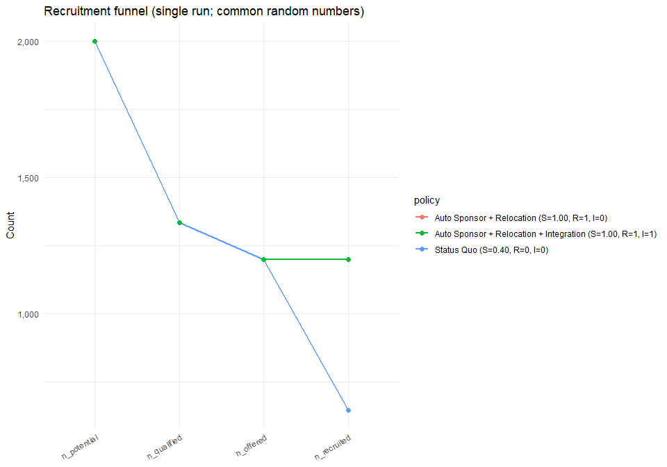

<div class="figure" style="text-align: center">

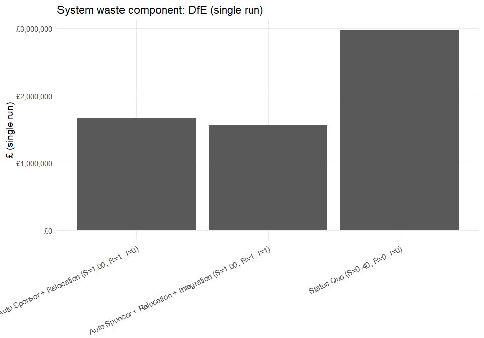
<p class="caption">

System waste decomposition by policy (single run, CRN): DfE vs School vs
Teacher (one plot per component).
</p>

</div>

<div class="figure" style="text-align: center">

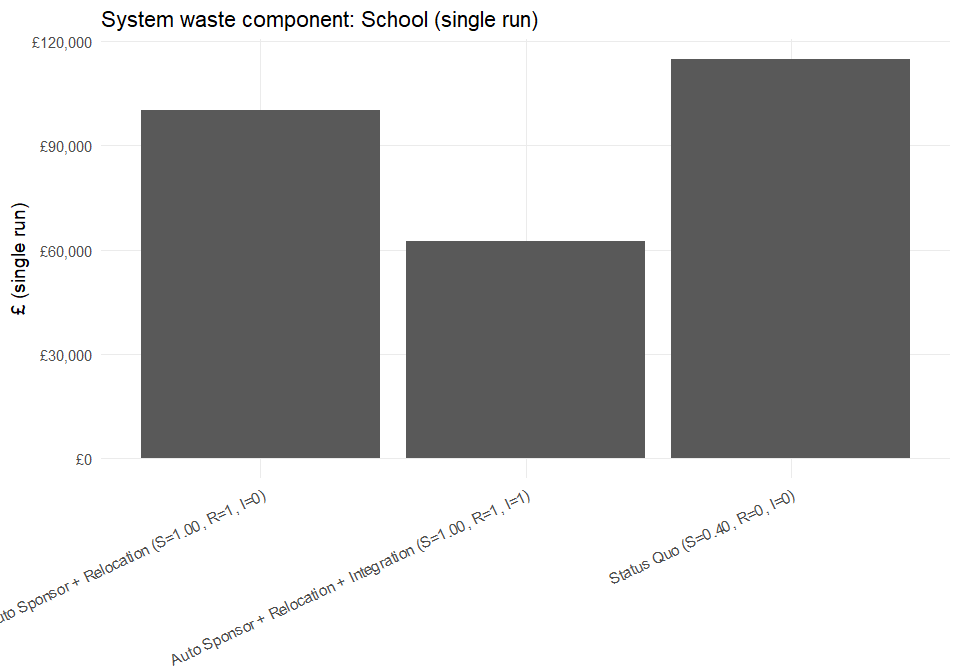
<p class="caption">

System waste decomposition by policy (single run, CRN): DfE vs School vs
Teacher (one plot per component).
</p>

</div>

<div class="figure" style="text-align: center">

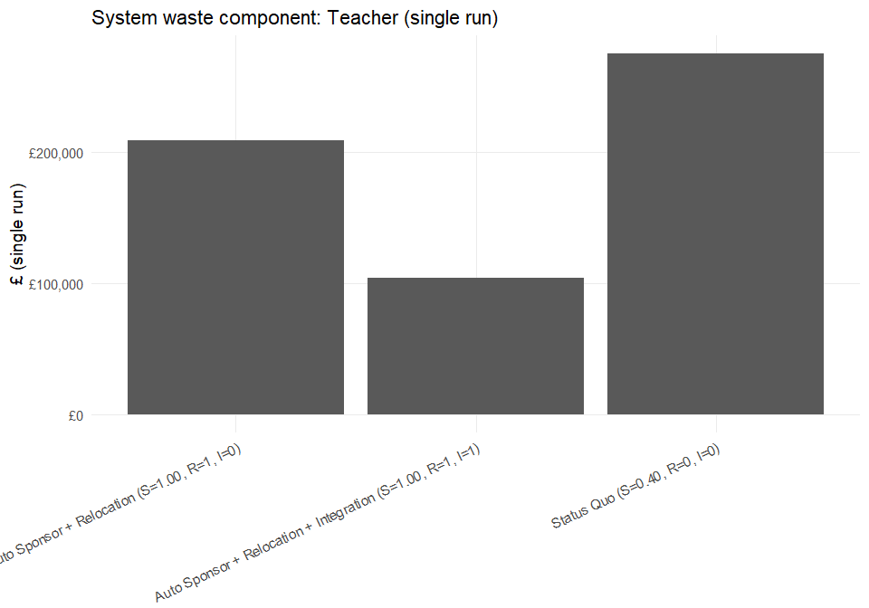
<p class="caption">

System waste decomposition by policy (single run, CRN): DfE vs School vs
Teacher (one plot per component).
</p>

</div>

``` r
# ============================================================
# Block 4 — Monte Carlo replication (R = 5000) with CRN per run
#   Caching: load if schema matches; otherwise run + cache.
#   CI standard: 99% (z_{0.995}).
# ============================================================

stopifnot(
  exists("generate_potential_overseas"),
  exists("add_training_and_offers"),
  exists("assign_training_incentives"),
  exists("apply_policy_and_score"),
  exists("policy_A"),
  exists("policy_B"),
  exists("policy_C")
)

R <- 5000
N0 <- 2000

policy_map <- tibble::tibble(
  policy = c(policy_A$name, policy_B$name, policy_C$name),
  policy_id = c("A", "B", "C"),
  policy_short = c("Status Quo", "Auto Sponsor + Relocation", "Auto Sponsor + Relocation + Integration")
)

if (!exists("z_0.995")) z_0.995 <- qnorm(0.995)

mc_summarise <- function(x) {
  x <- x[is.finite(x)]
  n <- length(x)
  if (n == 0) {
    return(tibble::tibble(n = 0L, mean = NA_real_, sd = NA_real_, mcse = NA_real_, ci_low = NA_real_, ci_high = NA_real_))
  }
  m <- mean(x)
  s <- stats::sd(x)
  se <- s / sqrt(n)
  tibble::tibble(
    n = n,
    mean = m,
    sd = s,
    mcse = se,
    ci_low = m - z_0.995 * se,
    ci_high = m + z_0.995 * se
  )
}

# Formatting helpers (always return character)
fmt_num <- function(x, digits = 3) formatC(x, format = "f", digits = digits)
fmt_ci_num <- function(lo, hi, digits = 3) paste0("[", fmt_num(lo, digits), ", ", fmt_num(hi, digits), "]")

run_one_replication <- function(rep_id, N0 = 2000, params = params) {

  potential <- generate_potential_overseas(
    n = N0,
    probs_overseas_group = probs_overseas_group,
    probs_subject_overseas = probs_subject_overseas,
    probs_degree_overseas_all = probs_degree_overseas_all,
    p_eu_has_euss = params$p_eu_has_euss,
    prob_exceptional = params$prob_exceptional
  )

  # Training completion + offer gate + incentives
  pipeline <- add_training_and_offers(
    df_potential = potential,
    capacity_posts = params$capacity_posts,
    u_qual = runif(nrow(potential)),
    seed_offer = 777 + rep_id
  ) |>
    assign_training_incentives(params = params)

  # Common random numbers across policies within this replication
  n_pipe <- nrow(pipeline)
  u_sponsor_all <- runif(n_pipe)
  u_retention_all <- runif(n_pipe)
  u_integration_all <- runif(n_pipe)

  res_A <- apply_policy_and_score(
    df_pipeline = pipeline,
    policy = policy_A,
    relocation_subjects = params$relocation_subjects,
    u_integration = u_integration_all,
    u_sponsor = u_sponsor_all,
    u_retention = u_retention_all,
    params = params
  )$summary

  res_B <- apply_policy_and_score(
    df_pipeline = pipeline,
    policy = policy_B,
    relocation_subjects = params$relocation_subjects,
    u_integration = u_integration_all,
    u_sponsor = u_sponsor_all,
    u_retention = u_retention_all,
    params = params
  )$summary

  res_C <- apply_policy_and_score(
    df_pipeline = pipeline,
    policy = policy_C,
    relocation_subjects = params$relocation_subjects,
    u_integration = u_integration_all,
    u_sponsor = u_sponsor_all,
    u_retention = u_retention_all,
    params = params
  )$summary

  dplyr::bind_rows(res_A, res_B, res_C) |>
    dplyr::mutate(
      rep = rep_id,
      total_system_waste = total_dfe_waste + total_school_waste + total_teacher_waste,
      retained_year1 = n_recruited * (1 - attrition_rate_year1),
      waste_per_retained = total_system_waste / pmax(retained_year1, 1)
    ) |>
    dplyr::left_join(policy_map, by = "policy") |>
    dplyr::select(rep, policy_id, policy, policy_short, dplyr::everything())
}

# Cache (versioned + schema gated)
mc_path <- cache_path(paste0("mc_abc_R", R))

required_cols <- c(
  "rep", "policy_id", "policy", "policy_short",
  "n_recruited", "n_qualified", "n_offered",
  "recruitment_rate", "recruited_over_capacity", "recruited_over_qualified",
  "attrition_rate_year1", "share_needs_visa_among_recruited", "share_integration_among_recruited_needs_visa",
  "total_dfe_spend", "total_dfe_waste", "dfe_waste_rate",
  "total_school_spend", "total_school_waste", "school_waste_rate",
  "total_teacher_spend", "total_teacher_waste", "teacher_waste_rate",
  "total_system_waste", "retained_year1", "waste_per_retained"
)

if (csv_schema_matches(mc_path, required_cols)) {
  mc_abc <- readr::read_csv(mc_path, show_col_types = FALSE)
  cat("Loaded cached ", mc_path, "\n", sep = "")
} else {
  set.seed(20250117)

  set.seed(20250117)  
mc_abc <- run_simulation_parallel(
  R = R,
  N0 = N0,
  params = params,
  workers = NULL,                  
  plan_strategy = "multisession",  
  progress = FALSE                 
)

  readr::write_csv(mc_abc, mc_path)
  cat("Ran simulation and cached ", mc_path, "\n", sep = "")
}
```

    ## Loaded cached cache/mc_abc_R5000_v4_99ci_ABF_parallel_20260425.csv

``` r
metrics <- c(
  "n_recruited",
  "recruitment_rate",
  "recruited_over_capacity",
  "recruited_over_qualified",
  "attrition_rate_year1",
  "share_needs_visa_among_recruited",
  "total_dfe_spend",
  "total_dfe_waste",
  "dfe_waste_rate",
  "total_school_spend",
  "total_school_waste",
  "school_waste_rate",
  "total_teacher_spend",
  "total_teacher_waste",
  "teacher_waste_rate",
  "total_system_waste",
  "waste_per_retained"
)

mc_summary <- mc_abc |>
  dplyr::select(policy_id, policy_short, dplyr::all_of(metrics)) |>
  tidyr::pivot_longer(cols = dplyr::all_of(metrics), names_to = "metric", values_to = "value") |>
  dplyr::group_by(policy_id, policy_short, metric) |>
  dplyr::group_modify(~ mc_summarise(.x$value)) |>
  dplyr::ungroup()

mc_key_tbl <- mc_summary |>
  dplyr::filter(metric %in% c("n_recruited", "recruitment_rate", "attrition_rate_year1", "total_system_waste", "waste_per_retained")) |>
  dplyr::mutate(
    mean_fmt = dplyr::case_when(
      metric == "total_system_waste" ~ pound(mean, accuracy = 1),
      metric == "waste_per_retained" ~ pound(mean, accuracy = 0.01),
      metric %in% c("attrition_rate_year1", "recruitment_rate") ~ scales::percent(mean, accuracy = 0.01),
      TRUE ~ fmt_num(mean, digits = 0)
    ),
    ci_fmt = dplyr::case_when(
      metric == "total_system_waste" ~ paste0("[", pound(ci_low, accuracy = 1), ", ", pound(ci_high, accuracy = 1), "]"),
      metric == "waste_per_retained" ~ paste0("[", pound(ci_low, accuracy = 0.01), ", ", pound(ci_high, accuracy = 0.01), "]"),
      metric %in% c("attrition_rate_year1", "recruitment_rate") ~ paste0("[", scales::percent(ci_low, accuracy = 0.01), ", ", scales::percent(ci_high, accuracy = 0.01), "]"),
      TRUE ~ fmt_ci_num(ci_low, ci_high, digits = 0)
    )
  ) |>
  dplyr::select(policy_id, policy_short, metric, n, mean_fmt, ci_fmt, mcse) |>
  dplyr::arrange(policy_id, metric)

knitr::kable(
  mc_key_tbl,
  caption = "Monte Carlo summary (R=5000): mean with 99% CI and MCSE (paired CRN within replication)."
)
```

| policy_id | policy_short | metric | n | mean_fmt | ci_fmt | mcse |
|:---|:---|:---|---:|:---|:---|---:|
| A | Status Quo | attrition_rate_year1 | 5000 | 17.15% | \[17.09%, 17.20%\] | 0.0002084 |
| A | Status Quo | n_recruited | 5000 | 644 | \[643, 644\] | 0.2381974 |
| A | Status Quo | recruitment_rate | 5000 | 32.19% | \[32.16%, 32.22%\] | 0.0001191 |
| A | Status Quo | total_system_waste | 5000 | £3,487,343 | \[£3,477,251, £3,497,435\] | 3917.8959351 |
| A | Status Quo | waste_per_retained | 5000 | £6,548.15 | \[£6,526.41, £6,569.89\] | 8.4396779 |
| B | Auto Sponsor + Relocation | attrition_rate_year1 | 5000 | 8.80% | \[8.77%, 8.83%\] | 0.0001147 |
| B | Auto Sponsor + Relocation | n_recruited | 5000 | 1200 | \[1200, 1200\] | 0.0000000 |
| B | Auto Sponsor + Relocation | recruitment_rate | 5000 | 60.00% | \[60.00%, 60.00%\] | 0.0000000 |
| B | Auto Sponsor + Relocation | total_system_waste | 5000 | £2,167,592 | \[£2,159,767, £2,175,418\] | 3038.0366036 |
| B | Auto Sponsor + Relocation | waste_per_retained | 5000 | £1,981.36 | \[£1,973.99, £1,988.73\] | 2.8609431 |
| C | Auto Sponsor + Relocation + Integration | attrition_rate_year1 | 5000 | 6.09% | \[6.06%, 6.11%\] | 0.0000970 |
| C | Auto Sponsor + Relocation + Integration | n_recruited | 5000 | 1200 | \[1200, 1200\] | 0.0000000 |
| C | Auto Sponsor + Relocation + Integration | recruitment_rate | 5000 | 60.00% | \[60.00%, 60.00%\] | 0.0000000 |
| C | Auto Sponsor + Relocation + Integration | total_system_waste | 5000 | £1,907,444 | \[£1,899,967, £1,914,922\] | 2903.0448357 |
| C | Auto Sponsor + Relocation + Integration | waste_per_retained | 5000 | £1,692.96 | \[£1,686.20, £1,699.72\] | 2.6245245 |

Monte Carlo summary (R=5000): mean with 99% CI and MCSE (paired CRN
within replication).

``` r
wide <- mc_abc |>
  dplyr::select(rep, policy_id, waste_per_retained, total_system_waste, attrition_rate_year1) |>
  tidyr::pivot_wider(names_from = policy_id, values_from = c(waste_per_retained, total_system_waste, attrition_rate_year1))

diffs <- wide |>
  dplyr::transmute(
    rep,
    d_waste_B_minus_A = waste_per_retained_B - waste_per_retained_A,
    d_waste_C_minus_A = waste_per_retained_C - waste_per_retained_A,
    d_system_B_minus_A = total_system_waste_B - total_system_waste_A,
    d_system_C_minus_A = total_system_waste_C - total_system_waste_A,
    d_attrition_B_minus_A = attrition_rate_year1_B - attrition_rate_year1_A,
    d_attrition_C_minus_A = attrition_rate_year1_C - attrition_rate_year1_A
  )

diff_summary <- diffs |>
  tidyr::pivot_longer(cols = -rep, names_to = "contrast", values_to = "value") |>
  dplyr::group_by(contrast) |>
  dplyr::group_modify(~ mc_summarise(.x$value)) |>
  dplyr::ungroup()

# IMPORTANT: every branch returns character (no type mixing)
diff_tbl <- diff_summary |>
  dplyr::mutate(
    mean_fmt = dplyr::case_when(
      stringr::str_detect(contrast, "d_system_") ~ pound(mean, accuracy = 1),
      stringr::str_detect(contrast, "d_waste_") ~ pound(mean, accuracy = 0.01),
      stringr::str_detect(contrast, "d_attrition_") ~ scales::percent(mean, accuracy = 0.01),
      TRUE ~ fmt_num(mean, digits = 3)
    ),
    ci_fmt = dplyr::case_when(
      stringr::str_detect(contrast, "d_system_") ~ paste0("[", pound(ci_low, accuracy = 1), ", ", pound(ci_high, accuracy = 1), "]"),
      stringr::str_detect(contrast, "d_waste_") ~ paste0("[", pound(ci_low, accuracy = 0.01), ", ", pound(ci_high, accuracy = 0.01), "]"),
      stringr::str_detect(contrast, "d_attrition_") ~ paste0("[", scales::percent(ci_low, accuracy = 0.01), ", ", scales::percent(ci_high, accuracy = 0.01), "]"),
      TRUE ~ fmt_ci_num(ci_low, ci_high, digits = 3)
    )
  ) |>
  dplyr::select(contrast, n, mean_fmt, ci_fmt, mcse) |>
  dplyr::arrange(contrast)

knitr::kable(
  diff_tbl,
  caption = "Paired policy effects (B−A and C−A): mean with 99% CI and MCSE (R=5000)."
)
```

| contrast | n | mean_fmt | ci_fmt | mcse |
|:---|---:|:---|:---|---:|
| d_attrition_B_minus_A | 5000 | -8.35% | \[-8.39%, -8.30%\] | 0.0001768 |
| d_attrition_C_minus_A | 5000 | -11.06% | \[-11.11%, -11.02%\] | 0.0001810 |
| d_system_B_minus_A | 5000 | -£1,319,751 | \[-£1,326,984, -£1,312,518\] | 2808.1053926 |
| d_system_C_minus_A | 5000 | -£1,579,899 | \[-£1,587,330, -£1,572,467\] | 2885.1174722 |
| d_waste_B_minus_A | 5000 | -£4,566.79 | \[-£4,584.76, -£4,548.82\] | 6.9770592 |
| d_waste_C_minus_A | 5000 | -£4,855.19 | \[-£4,873.63, -£4,836.75\] | 7.1585179 |

Paired policy effects (B−A and C−A): mean with 99% CI and MCSE (R=5000).

``` r
## ============================================================
## Internal Validation Pack — invariants + accounting + monotonicity
## Run AFTER Block 4 (requires mc_abc in memory)
## ============================================================

stopifnot(exists("mc_abc"))
suppressPackageStartupMessages({
  library(dplyr)
  library(tidyr)
  library(tibble)
})

strict <- TRUE          # TRUE = stop knit on failure; FALSE = warn + continue
tol <- 1e-10            # numerical tolerance for identities

fail_if <- function(ok, msg, offenders = NULL) {
  if (isTRUE(ok)) return(invisible(TRUE))
  if (!is.null(offenders) && nrow(offenders) > 0) print(offenders)
  if (strict) stop(msg, call. = FALSE) else warning(msg, call. = FALSE)
  invisible(FALSE)
}

# -----------------------------
# V1) Basic bounds + finiteness
# -----------------------------
need_cols <- c(
  "rep","policy_id",
  "n_recruited","n_qualified","n_offered",
  "recruitment_rate","recruited_over_capacity","recruited_over_qualified",
  "attrition_rate_year1",
  "share_needs_visa_among_recruited","share_integration_among_recruited_needs_visa",
  "total_dfe_spend","total_dfe_waste","dfe_waste_rate",
  "total_school_spend","total_school_waste","school_waste_rate",
  "total_teacher_spend","total_teacher_waste","teacher_waste_rate",
  "total_system_waste","retained_year1","waste_per_retained"
)

miss <- setdiff(need_cols, names(mc_abc))
fail_if(length(miss) == 0, paste0("mc_abc missing required cols: ", paste(miss, collapse = ", ")))

bad_bounds <- mc_abc %>%
  filter(
    !is.finite(recruitment_rate) | recruitment_rate < 0 | recruitment_rate > 1 |
    !is.finite(attrition_rate_year1) | attrition_rate_year1 < 0 | attrition_rate_year1 > 1 |
    (!is.na(share_needs_visa_among_recruited) &
       (share_needs_visa_among_recruited < 0 | share_needs_visa_among_recruited > 1)) |
    (!is.na(share_integration_among_recruited_needs_visa) &
       (share_integration_among_recruited_needs_visa < 0 | share_integration_among_recruited_needs_visa > 1)) |
    n_recruited < 0 | n_qualified < 0 | n_offered < 0 |
    !is.finite(total_system_waste) | total_system_waste < 0 |
    !is.finite(waste_per_retained) | waste_per_retained < 0
  ) %>%
  select(rep, policy_id, n_recruited, n_qualified, n_offered,
         recruitment_rate, attrition_rate_year1,
         share_needs_visa_among_recruited, share_integration_among_recruited_needs_visa,
         total_system_waste, waste_per_retained) %>%
  head(12)

fail_if(nrow(bad_bounds) == 0, "V1 failed: bounds/finite/nonnegativity violations.", bad_bounds)

# -----------------------------
# V2) Accounting identities (must hold row-wise)
# -----------------------------
acct <- mc_abc %>%
  mutate(
    chk_system = abs(total_system_waste - (total_dfe_waste + total_school_waste + total_teacher_waste)),
    chk_retained = abs(retained_year1 - n_recruited * (1 - attrition_rate_year1)),
    chk_wpr = abs(waste_per_retained - total_system_waste / pmax(retained_year1, 1)),
    chk_dfe_rate = abs(dfe_waste_rate - if_else(total_dfe_spend > 0, total_dfe_waste / total_dfe_spend, NA_real_)),
    chk_school_rate = abs(school_waste_rate - if_else(total_school_spend > 0, total_school_waste / total_school_spend, NA_real_)),
    chk_teacher_rate = abs(teacher_waste_rate - if_else(total_teacher_spend > 0, total_teacher_waste / total_teacher_spend, NA_real_))
  )

bad_acct <- acct %>%
  filter(
    chk_system > tol |
    chk_retained > tol |
    chk_wpr > tol |
    (!is.na(chk_dfe_rate) & chk_dfe_rate > tol) |
    (!is.na(chk_school_rate) & chk_school_rate > tol) |
    (!is.na(chk_teacher_rate) & chk_teacher_rate > tol)
  ) %>%
  select(rep, policy_id, chk_system, chk_retained, chk_wpr, chk_dfe_rate, chk_school_rate, chk_teacher_rate) %>%
  head(12)

fail_if(nrow(bad_acct) == 0, "V2 failed: accounting identities do not hold.", bad_acct)

bad_waste_vs_spend <- mc_abc %>%
  filter(
    total_dfe_waste - total_dfe_spend > tol |
    total_school_waste - total_school_spend > tol |
    total_teacher_waste - total_teacher_spend > tol
  ) %>%
  select(rep, policy_id,
         total_dfe_spend, total_dfe_waste,
         total_school_spend, total_school_waste,
         total_teacher_spend, total_teacher_waste) %>%
  head(12)

fail_if(nrow(bad_waste_vs_spend) == 0, "V2 failed: some waste exceeds spend.", bad_waste_vs_spend)

# -----------------------------
# V3) Pipeline invariants (within same rep, A/B/C share the same pipeline)
# n_offered and n_qualified should be identical across policies per rep.
# -----------------------------
rep_invar <- mc_abc %>%
  group_by(rep) %>%
  summarise(
    span_offered = max(n_offered) - min(n_offered),
    span_qualified = max(n_qualified) - min(n_qualified),
    .groups = "drop"
  ) %>%
  filter(span_offered != 0 | span_qualified != 0) %>%
  head(12)

fail_if(
  nrow(rep_invar) == 0,
  "V3 failed: within-rep pipeline invariants violated (n_offered/n_qualified differ across A/B/C).",
  rep_invar
)

# -----------------------------
# V4) Policy structural invariants under your design
# B and C are both auto-sponsor -> should recruit everyone offered (n_recruited == n_offered).
# C adds integration boost -> attrition_C must be <= attrition_B per rep (CRN).
# B and C share relocation schedule -> DfE spend and Teacher spend should match.
# -----------------------------
wide <- mc_abc %>%
  select(
    rep, policy_id,
    n_recruited, n_offered,
    attrition_rate_year1,
    total_dfe_spend, total_teacher_spend,
    share_integration_among_recruited_needs_visa
  ) %>%
  pivot_wider(
    names_from = policy_id,
    values_from = c(
      n_recruited, n_offered,
      attrition_rate_year1,
      total_dfe_spend, total_teacher_spend,
      share_integration_among_recruited_needs_visa
    )
  )

viol <- wide %>%
  filter(
    n_recruited_B != n_offered_B |
    n_recruited_C != n_offered_C |
    n_recruited_C != n_recruited_B |
    n_recruited_B < n_recruited_A |
    n_recruited_C < n_recruited_A |
    attrition_rate_year1_C > attrition_rate_year1_B + 1e-12 |
    abs(total_dfe_spend_B - total_dfe_spend_C) > tol |
    abs(total_teacher_spend_B - total_teacher_spend_C) > tol |
    (!is.na(share_integration_among_recruited_needs_visa_C) &
       share_integration_among_recruited_needs_visa_C < 1 - 1e-12)
  ) %>%
  head(12)

fail_if(nrow(viol) == 0, "V4 failed: policy invariants/monotonicity violated.", viol)

cat("✔ Internal Validation Pack PASSED (V1–V4).\n")
```

    ## ✔ Internal Validation Pack PASSED (V1–V4).

``` r
## ============================================================
## Edge-case smoke tests (fast)
## Purpose: "does it run + do invariants hold" on tiny/degenerate settings
## ============================================================

stopifnot(exists("run_one_replication"), exists("params"))

edge_cases <- list(
  list(name = "N0=1, capacity=0", N0 = 1, params = modifyList(params, list(capacity_posts = 0))),
  list(name = "N0=1, capacity=1", N0 = 1, params = modifyList(params, list(capacity_posts = 1))),
  list(name = "EU all EUSS (p=1)", N0 = 200, params = modifyList(params, list(p_eu_has_euss = 1))),
  list(name = "EU none EUSS (p=0)", N0 = 200, params = modifyList(params, list(p_eu_has_euss = 0))),
  list(name = "No exceptional quals", N0 = 200, params = modifyList(params, list(prob_exceptional = 0))),
  list(name = "All exceptional quals", N0 = 200, params = modifyList(params, list(prob_exceptional = 1)))
)

for (ec in edge_cases) {
  out <- run_one_replication(rep_id = 1, N0 = ec$N0, params = ec$params)

  stopifnot(nrow(out) == 3L)
  stopifnot(all(out$n_recruited <= out$n_offered))
  stopifnot(all(out$total_system_waste >= 0))

  # capacity check only if capacity_posts exists in your params
  if (!is.null(ec$params$capacity_posts)) {
    stopifnot(all(out$n_offered <= ec$params$capacity_posts))
  }

  cat("✔ Edge OK:", ec$name, "\n")
}
```

    ## ✔ Edge OK: N0=1, capacity=0 
    ## ✔ Edge OK: N0=1, capacity=1 
    ## ✔ Edge OK: EU all EUSS (p=1) 
    ## ✔ Edge OK: EU none EUSS (p=0) 
    ## ✔ Edge OK: No exceptional quals 
    ## ✔ Edge OK: All exceptional quals

``` r
# ============================================================
# Block 5 — Report tables from cached MC (no rerun here)
#   CI standard: 99% (z_{0.995}).
# ============================================================

if (!exists("z_0.995")) z_0.995 <- qnorm(0.995)

mc_summarise <- function(x) {
  x <- x[is.finite(x)]
  n <- length(x)
  if (n == 0) {
    return(tibble::tibble(n = 0L, mean = NA_real_, sd = NA_real_, mcse = NA_real_, ci_low = NA_real_, ci_high = NA_real_))
  }
  m <- mean(x)
  s <- stats::sd(x)
  se <- s / sqrt(n)
  tibble::tibble(
    n = n,
    mean = m,
    sd = s,
    mcse = se,
    ci_low = m - z_0.995 * se,
    ci_high = m + z_0.995 * se
  )
}

mc_path <- cache_path("mc_abc_R5000")

required_cols <- c(
  "rep", "policy_id", "policy", "policy_short",
  "n_recruited", "n_qualified", "n_offered",
  "recruitment_rate", "recruited_over_capacity", "recruited_over_qualified",
  "attrition_rate_year1", "share_needs_visa_among_recruited", "share_integration_among_recruited_needs_visa",
  "total_dfe_spend", "total_dfe_waste", "dfe_waste_rate",
  "total_school_spend", "total_school_waste", "school_waste_rate",
  "total_teacher_spend", "total_teacher_waste", "teacher_waste_rate",
  "total_system_waste", "retained_year1", "waste_per_retained"
)

if (!csv_schema_matches(mc_path, required_cols)) {
  stop(
    "MC cache missing or schema mismatch: ", mc_path, "\n",
    "Re-knit from Block 4 to regenerate the cache under the current cache_version."
  )
}

mc_abc <- readr::read_csv(mc_path, show_col_types = FALSE)
cat("✔ Loaded MC cache for reporting: ", mc_path, "\n", sep = "")
```

    ## ✔ Loaded MC cache for reporting: cache/mc_abc_R5000_v4_99ci_ABF_parallel_20260425.csv

``` r
# -----------------------------
# Clean report tables
# -----------------------------

metrics_main <- c(
  "n_recruited",
  "recruitment_rate",
  "recruited_over_capacity",
  "recruited_over_qualified",
  "attrition_rate_year1",
  "share_needs_visa_among_recruited",
  "share_integration_among_recruited_needs_visa",
  "total_dfe_spend",
  "total_dfe_waste",
  "dfe_waste_rate",
  "total_school_spend",
  "total_school_waste",
  "school_waste_rate",
  "total_teacher_spend",
  "total_teacher_waste",
  "teacher_waste_rate",
  "total_system_waste",
  "waste_per_retained"
)

mc_summary <- mc_abc %>%
  dplyr::select(policy_id, policy_short, dplyr::all_of(metrics_main)) %>%
  tidyr::pivot_longer(cols = dplyr::all_of(metrics_main), names_to = "metric", values_to = "value") %>%
  dplyr::group_by(policy_id, policy_short, metric) %>%
  dplyr::group_modify(~ mc_summarise(.x$value)) %>%
  dplyr::ungroup()

label_metric <- function(m) {
  dplyr::case_when(
    m == "n_recruited" ~ "Recruited (count)",
    m == "recruitment_rate" ~ "Recruited share (of simulated accepted cohort)",
    m == "recruited_over_capacity" ~ "Recruited / capacity",
    m == "recruited_over_qualified" ~ "Recruited / qualified",
    m == "attrition_rate_year1" ~ "Attrition rate (year 1)",
    m == "share_needs_visa_among_recruited" ~ "Needs-visa share among recruited",
    m == "share_integration_among_recruited_needs_visa" ~ "Integration share among visa-recruited",
    m == "total_dfe_spend" ~ "DfE spend (£)",
    m == "total_dfe_waste" ~ "DfE waste (£)",
    m == "dfe_waste_rate" ~ "DfE waste rate",
    m == "total_school_spend" ~ "School spend (£)",
    m == "total_school_waste" ~ "School waste (£)",
    m == "school_waste_rate" ~ "School waste rate",
    m == "total_teacher_spend" ~ "Teacher spend (£)",
    m == "total_teacher_waste" ~ "Teacher waste (£)",
    m == "teacher_waste_rate" ~ "Teacher waste rate",
    m == "total_system_waste" ~ "System waste (£)",
    m == "waste_per_retained" ~ "Waste per retained teacher (£)",
    TRUE ~ m
  )
}

format_mean_ci <- function(metric, mean, lo, hi) {
  if (metric %in% c("total_dfe_spend","total_dfe_waste","total_school_spend","total_school_waste",
                    "total_teacher_spend","total_teacher_waste","total_system_waste")) {
    return(paste0(pound(mean, accuracy = 1), " [", pound(lo, accuracy = 1), ", ", pound(hi, accuracy = 1), "]"))
  }
  if (metric == "waste_per_retained") {
    return(paste0(pound(mean, accuracy = 0.01), " [", pound(lo, accuracy = 0.01), ", ", pound(hi, accuracy = 0.01), "]"))
  }
  if (metric %in% c("recruitment_rate","attrition_rate_year1","share_needs_visa_among_recruited",
                    "share_integration_among_recruited_needs_visa","dfe_waste_rate","school_waste_rate","teacher_waste_rate")) {
    return(paste0(scales::percent(mean, accuracy = 0.01), " [",
                  scales::percent(lo, accuracy = 0.01), ", ",
                  scales::percent(hi, accuracy = 0.01), "]"))
  }
  paste0(round(mean, 3), " [", round(lo, 3), ", ", round(hi, 3), "]")
}

format_mcse <- function(metric, mcse) {
  if (!is.finite(mcse)) return(NA_character_)
  if (metric %in% c("total_dfe_spend","total_dfe_waste","total_school_spend","total_school_waste",
                    "total_teacher_spend","total_teacher_waste","total_system_waste","waste_per_retained")) {
    return(pound(mcse, accuracy = 0.01))
  }
  if (metric %in% c("recruitment_rate","attrition_rate_year1","share_needs_visa_among_recruited",
                    "share_integration_among_recruited_needs_visa","dfe_waste_rate","school_waste_rate","teacher_waste_rate")) {
    return(scales::percent(mcse, accuracy = 0.01))
  }
  as.character(round(mcse, 4))
}

tbl_report <- mc_summary %>%
  dplyr::mutate(
    Metric = label_metric(metric),
    `Mean [99% CI]` = purrr::pmap_chr(
      list(metric, mean, ci_low, ci_high),
      ~ format_mean_ci(..1, ..2, ..3, ..4)
    ),
    MCSE = purrr::map2_chr(metric, mcse, format_mcse)
  ) %>%
  dplyr::select(policy_id, policy_short, Metric, `Mean [99% CI]`, MCSE) %>%
  dplyr::arrange(policy_id, Metric)

knitr::kable(
  tbl_report,
  caption = "Monte Carlo results (R=5000): mean with 99% CI and MCSE (report table)."
)
```

| policy_id | policy_short | Metric | Mean \[99% CI\] | MCSE |
|:---|:---|:---|:---|:---|
| A | Status Quo | Attrition rate (year 1) | 17.15% \[17.09%, 17.20%\] | 0.02% |
| A | Status Quo | DfE spend (£) | £4,214,384 \[£4,202,895, £4,225,874\] | £4,460.49 |
| A | Status Quo | DfE waste (£) | £3,051,113 \[£3,041,242, £3,060,984\] | £3,832.23 |
| A | Status Quo | DfE waste rate | 72.40% \[72.27%, 72.52%\] | 0.05% |
| A | Status Quo | Integration share among visa-recruited | 0.00% \[0.00%, 0.00%\] | 0.00% |
| A | Status Quo | Needs-visa share among recruited | 57.56% \[57.49%, 57.63%\] | 0.03% |
| A | Status Quo | Recruited (count) | 643.755 \[643.142, 644.369\] | 0.2382 |
| A | Status Quo | Recruited / capacity | 0.536 \[0.536, 0.537\] | 2e-04 |
| A | Status Quo | Recruited / qualified | 0.492 \[0.492, 0.493\] | 2e-04 |
| A | Status Quo | Recruited share (of simulated accepted cohort) | 32.19% \[32.16%, 32.22%\] | 0.01% |
| A | Status Quo | School spend (£) | £599,185 \[£598,238, £600,133\] | £367.70 |
| A | Status Quo | School waste (£) | £128,462 \[£127,959, £128,965\] | £195.41 |
| A | Status Quo | School waste rate | 21.44% \[21.36%, 21.52%\] | 0.03% |
| A | Status Quo | System waste (£) | £3,487,343 \[£3,477,251, £3,497,435\] | £3,917.90 |
| A | Status Quo | Teacher spend (£) | £1,435,525 \[£1,433,256, £1,437,795\] | £880.93 |
| A | Status Quo | Teacher waste (£) | £307,768 \[£306,562, £308,974\] | £468.15 |
| A | Status Quo | Teacher waste rate | 21.44% \[21.36%, 21.52%\] | 0.03% |
| A | Status Quo | Waste per retained teacher (£) | £6,548.15 \[£6,526.41, £6,569.89\] | £8.44 |
| B | Auto Sponsor + Relocation | Attrition rate (year 1) | 8.80% \[8.77%, 8.83%\] | 0.01% |
| B | Auto Sponsor + Relocation | DfE spend (£) | £5,174,076 \[£5,159,955, £5,188,197\] | £5,482.15 |
| B | Auto Sponsor + Relocation | DfE waste (£) | £1,787,057 \[£1,779,437, £1,794,678\] | £2,958.56 |
| B | Auto Sponsor + Relocation | DfE waste rate | 34.57% \[34.45%, 34.70%\] | 0.05% |
| B | Auto Sponsor + Relocation | Integration share among visa-recruited | 0.00% \[0.00%, 0.00%\] | 0.00% |
| B | Auto Sponsor + Relocation | Needs-visa share among recruited | 77.23% \[77.19%, 77.28%\] | 0.02% |
| B | Auto Sponsor + Relocation | Recruited (count) | 1200 \[1200, 1200\] | 0 |
| B | Auto Sponsor + Relocation | Recruited / capacity | 1 \[1, 1\] | 0 |
| B | Auto Sponsor + Relocation | Recruited / qualified | 0.918 \[0.917, 0.918\] | 2e-04 |
| B | Auto Sponsor + Relocation | Recruited share (of simulated accepted cohort) | 60.00% \[60.00%, 60.00%\] | 0.00% |
| B | Auto Sponsor + Relocation | School spend (£) | £1,498,633 \[£1,497,790, £1,499,476\] | £327.25 |
| B | Auto Sponsor + Relocation | School waste (£) | £120,770 \[£120,276, £121,263\] | £191.55 |
| B | Auto Sponsor + Relocation | School waste rate | 8.06% \[8.03%, 8.09%\] | 0.01% |
| B | Auto Sponsor + Relocation | System waste (£) | £2,167,592 \[£2,159,767, £2,175,418\] | £3,038.04 |
| B | Auto Sponsor + Relocation | Teacher spend (£) | £3,218,632 \[£3,216,408, £3,220,857\] | £863.72 |
| B | Auto Sponsor + Relocation | Teacher waste (£) | £259,765 \[£258,636, £260,894\] | £438.34 |
| B | Auto Sponsor + Relocation | Teacher waste rate | 8.07% \[8.04%, 8.11%\] | 0.01% |
| B | Auto Sponsor + Relocation | Waste per retained teacher (£) | £1,981.36 \[£1,973.99, £1,988.73\] | £2.86 |
| C | Auto Sponsor + Relocation + Integration | Attrition rate (year 1) | 6.09% \[6.06%, 6.11%\] | 0.01% |
| C | Auto Sponsor + Relocation + Integration | DfE spend (£) | £5,174,076 \[£5,159,955, £5,188,197\] | £5,482.15 |
| C | Auto Sponsor + Relocation + Integration | DfE waste (£) | £1,676,138 \[£1,668,813, £1,683,463\] | £2,843.92 |
| C | Auto Sponsor + Relocation + Integration | DfE waste rate | 32.43% \[32.31%, 32.55%\] | 0.05% |
| C | Auto Sponsor + Relocation + Integration | Integration share among visa-recruited | 100.00% \[100.00%, 100.00%\] | 0.00% |
| C | Auto Sponsor + Relocation + Integration | Needs-visa share among recruited | 77.23% \[77.19%, 77.28%\] | 0.02% |
| C | Auto Sponsor + Relocation + Integration | Recruited (count) | 1200 \[1200, 1200\] | 0 |
| C | Auto Sponsor + Relocation + Integration | Recruited / capacity | 1 \[1, 1\] | 0 |
| C | Auto Sponsor + Relocation + Integration | Recruited / qualified | 0.918 \[0.917, 0.918\] | 2e-04 |
| C | Auto Sponsor + Relocation + Integration | Recruited share (of simulated accepted cohort) | 60.00% \[60.00%, 60.00%\] | 0.00% |
| C | Auto Sponsor + Relocation + Integration | School spend (£) | £1,869,352 \[£1,868,301, £1,870,404\] | £408.20 |
| C | Auto Sponsor + Relocation + Integration | School waste (£) | £84,897 \[£84,426, £85,368\] | £182.94 |
| C | Auto Sponsor + Relocation + Integration | School waste rate | 4.54% \[4.52%, 4.57%\] | 0.01% |
| C | Auto Sponsor + Relocation + Integration | System waste (£) | £1,907,444 \[£1,899,967, £1,914,922\] | £2,903.04 |
| C | Auto Sponsor + Relocation + Integration | Teacher spend (£) | £3,218,632 \[£3,216,408, £3,220,857\] | £863.72 |
| C | Auto Sponsor + Relocation + Integration | Teacher waste (£) | £146,409 \[£145,549, £147,269\] | £333.94 |
| C | Auto Sponsor + Relocation + Integration | Teacher waste rate | 4.55% \[4.52%, 4.58%\] | 0.01% |
| C | Auto Sponsor + Relocation + Integration | Waste per retained teacher (£) | £1,692.96 \[£1,686.20, £1,699.72\] | £2.62 |

Monte Carlo results (R=5000): mean with 99% CI and MCSE (report table).

``` r
# ============================================================
# Appendix A — Robustness: sweep p_eu_has_euss with R=5000
# ------------------------------------------------------------
# For each p in grid:
#   - run R replications with CRN across policies within replication
#   - store MC means (and MCSEs) for key outcomes
#   - write results to CSV for reproducible plotting (versioned + schema-gated)
# ============================================================

stopifnot(
  exists("generate_potential_overseas"),
  exists("add_training_and_offers"),
  exists("assign_training_incentives"),
  exists("apply_policy_and_score"),
  exists("policy_A"),
  exists("policy_B"),
  exists("policy_C"),
  exists("probs_overseas_group"),
  exists("probs_subject_overseas"),
  exists("probs_degree_overseas_all"),
  exists("params"),
  exists("cache_path"),
  exists("csv_schema_matches")
)

need_params <- c("prob_exceptional", "capacity_posts", "relocation_subjects")
missing_params <- setdiff(need_params, names(params))
if (length(missing_params) > 0) stop("Missing params: ", paste(missing_params, collapse = ", "))

R <- 5000
N0 <- 2000
p_grid <- seq(0.2, 0.9, by = 0.1)

robust_file <- cache_path(paste0("robust_p_eu_has_euss_R", R))
robust_required_cols <- c("p_eu_has_euss","policy_id","policy_short","metric","n","mean","sd","mcse")

policy_map <- tibble::tibble(
  policy = c(policy_A$name, policy_B$name, policy_C$name),
  policy_id = c("A", "B", "C"),
  policy_short = c("Status quo", "Auto sponsor + relocation", "Auto sponsor + relocation + integration")
)

mc_summarise <- function(x) {
  x <- x[is.finite(x)]
  n <- length(x)
  if (n == 0) {
    return(tibble::tibble(n = 0L, mean = NA_real_, sd = NA_real_, mcse = NA_real_))
  }
  m <- mean(x)
  s <- stats::sd(x)
  tibble::tibble(n = n, mean = m, sd = s, mcse = s / sqrt(n))
}

# One replication at a given p_eu_has_euss (CRN shared across policies inside rep)
run_one_rep <- function(rep_id, p_eu, N0 = 2000, params = params) {

  potential <- generate_potential_overseas(
    n = N0,
    probs_overseas_group = probs_overseas_group,
    probs_subject_overseas = probs_subject_overseas,
    probs_degree_overseas_all = probs_degree_overseas_all,
    p_eu_has_euss = p_eu,
    prob_exceptional = params$prob_exceptional
  )

  pipeline <- add_training_and_offers(
    df_potential = potential,
    capacity_posts = params$capacity_posts,
    u_qual = runif(nrow(potential)),
    seed_offer = 777 + rep_id
  ) |>
    assign_training_incentives(params = params)

  n_pipe <- nrow(pipeline)
  u_sponsor_all <- runif(n_pipe)
  u_retention_all <- runif(n_pipe)
  u_integration_all <- runif(n_pipe)

  res_A <- apply_policy_and_score(
    df_pipeline = pipeline,
    policy = policy_A,
    relocation_subjects = params$relocation_subjects,
    u_integration = u_integration_all,
    u_sponsor = u_sponsor_all,
    u_retention = u_retention_all,
    params = params
  )$summary

  res_B <- apply_policy_and_score(
    df_pipeline = pipeline,
    policy = policy_B,
    relocation_subjects = params$relocation_subjects,
    u_integration = u_integration_all,
    u_sponsor = u_sponsor_all,
    u_retention = u_retention_all,
    params = params
  )$summary

  res_C <- apply_policy_and_score(
    df_pipeline = pipeline,
    policy = policy_C,
    relocation_subjects = params$relocation_subjects,
    u_integration = u_integration_all,
    u_sponsor = u_sponsor_all,
    u_retention = u_retention_all,
    params = params
  )$summary

  dplyr::bind_rows(res_A, res_B, res_C) |>
    dplyr::mutate(
      rep = rep_id,
      p_eu_has_euss = p_eu,
      total_system_waste = total_dfe_waste + total_school_waste + total_teacher_waste,
      retained_year1 = n_recruited * (1 - attrition_rate_year1),
      waste_per_retained = total_system_waste / pmax(retained_year1, 1)
    ) |>
    dplyr::left_join(policy_map, by = "policy") |>
    dplyr::select(p_eu_has_euss, rep, policy_id, policy_short, dplyr::everything())
}

# Build (or load) robustness table (schema-gated)
if (csv_schema_matches(robust_file, robust_required_cols)) {

  robust <- readr::read_csv(robust_file, show_col_types = FALSE)
  cat("Loaded cached ", robust_file, "\n", sep = "")

} else {

  set.seed(20250119)

  out_list <- vector("list", length(p_grid))

  for (i in seq_along(p_grid)) {

    p_val <- p_grid[i]

    res_list <- vector("list", R)
    for (r in seq_len(R)) {
      res_list[[r]] <- run_one_rep(r, p_val, N0 = N0, params = params)
    }

    mc <- dplyr::bind_rows(res_list)

    # Metrics: explicit and stable (avoid naming collisions)
    metrics <- c(
      "recruitment_rate",
      "recruited_over_capacity",
      "recruited_over_qualified",
      "attrition_rate_year1",
      "share_needs_visa_among_recruited",
      "total_dfe_waste",
      "total_teacher_waste",
      "total_system_waste",
      "waste_per_retained"
    )
    metrics <- intersect(metrics, names(mc))

    summ <- mc |>
      dplyr::select(p_eu_has_euss, policy_id, policy_short, dplyr::all_of(metrics)) |>
      tidyr::pivot_longer(cols = dplyr::all_of(metrics), names_to = "metric", values_to = "value") |>
      dplyr::group_by(p_eu_has_euss, policy_id, policy_short, metric) |>
      dplyr::group_modify(~ mc_summarise(.x$value)) |>
      dplyr::ungroup()

    out_list[[i]] <- summ
  }

  robust <- dplyr::bind_rows(out_list)
  readr::write_csv(robust, robust_file)
  cat("Ran robustness sweep and cached ", robust_file, "\n", sep = "")
}
```

    ## Loaded cached cache/robust_p_eu_has_euss_R5000_v4_99ci_ABF_parallel_20260425.csv

``` r
# Convenience subsets for plotting
robust_means <- robust |>
  dplyr::select(p_eu_has_euss, policy_short, metric, mean)

plot_line <- function(df, ylab, title, y_formatter = NULL) {
  p <- ggplot(df, aes(x = p_eu_has_euss, y = mean, linetype = policy_short, group = policy_short)) +
    geom_line(linewidth = 1, colour = "black") +
    geom_point(size = 2, colour = "black") +
    labs(x = "p_eu_has_euss", y = ylab, title = title) +
    theme_minimal() +
    theme(legend.title = element_blank())

  if (!is.null(y_formatter)) {
    p <- p + scale_y_continuous(labels = y_formatter)
  }
  p
}
```

``` r
df <- robust_means |>
  dplyr::filter(metric == "recruited_over_capacity")

plot_line(
  df,
  ylab = "Recruited / capacity",
  title = "Robustness: recruited over capacity vs p_eu_has_euss",
  y_formatter = scales::percent_format(accuracy = 1)
)
```

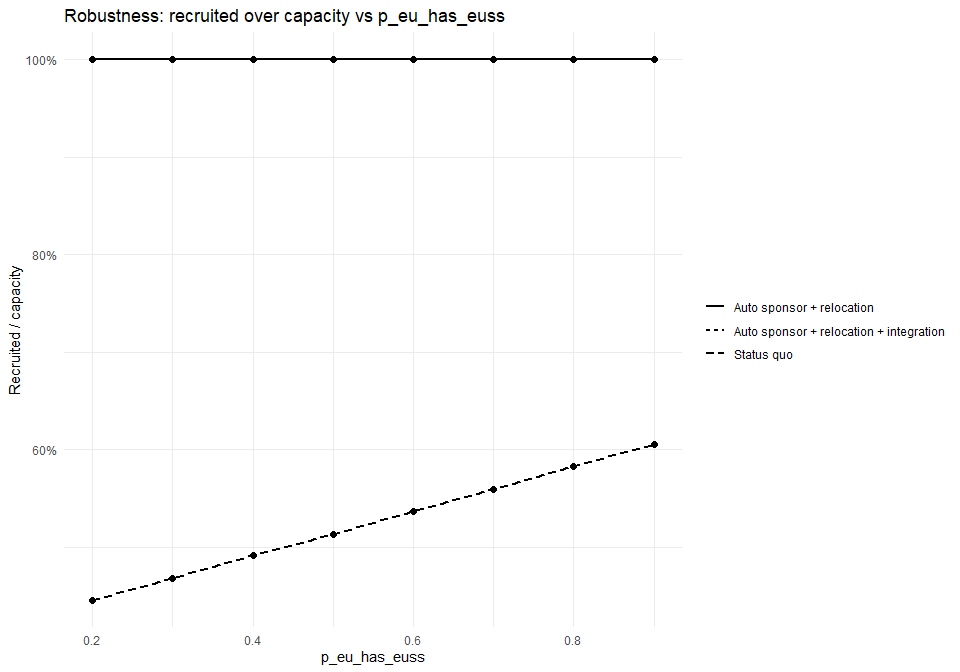

``` r
df <- robust_means |>
  dplyr::filter(metric == "attrition_rate_year1")

plot_line(
  df,
  ylab = "Attrition rate (year 1)",
  title = "Robustness: attrition (year 1) vs p_eu_has_euss",
  y_formatter = scales::percent_format(accuracy = 1)
)
```

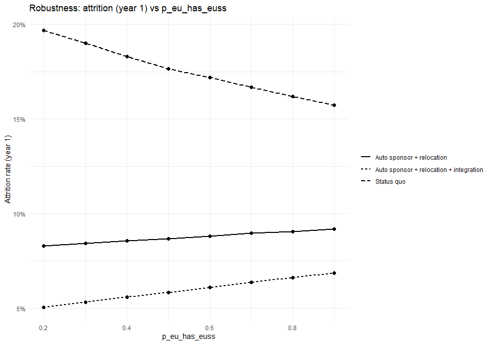

``` r
df <- robust_means |>
  dplyr::filter(metric == "share_needs_visa_among_recruited")

plot_line(
  df,
  ylab = "Needs-visa share among recruited",
  title = "Robustness: needs-visa share vs p_eu_has_euss",
  y_formatter = scales::percent_format(accuracy = 1)
)
```

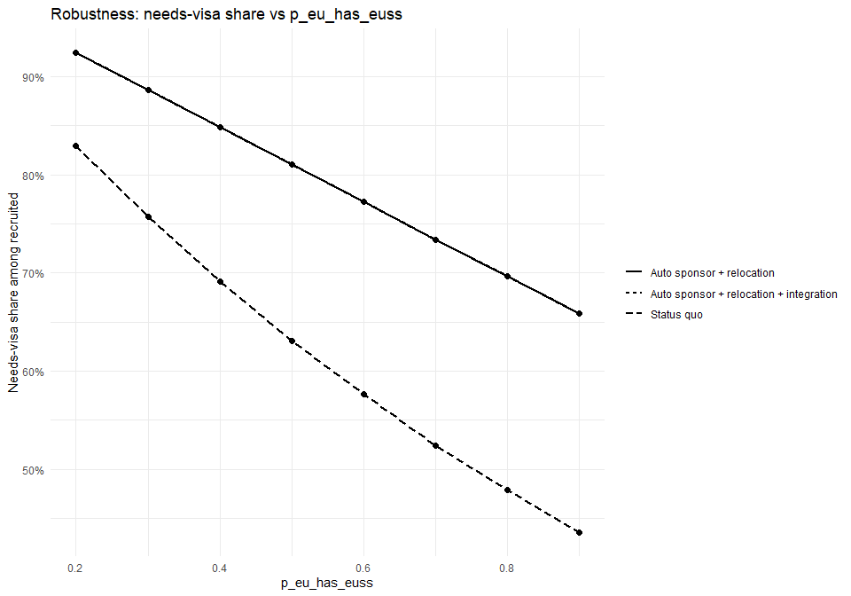

``` r
df <- robust_means |>
  dplyr::filter(metric == "total_dfe_waste")

plot_line(
  df,
  ylab = "DfE waste (£)",
  title = "Robustness: DfE waste vs p_eu_has_euss",
  y_formatter = pound
)
```

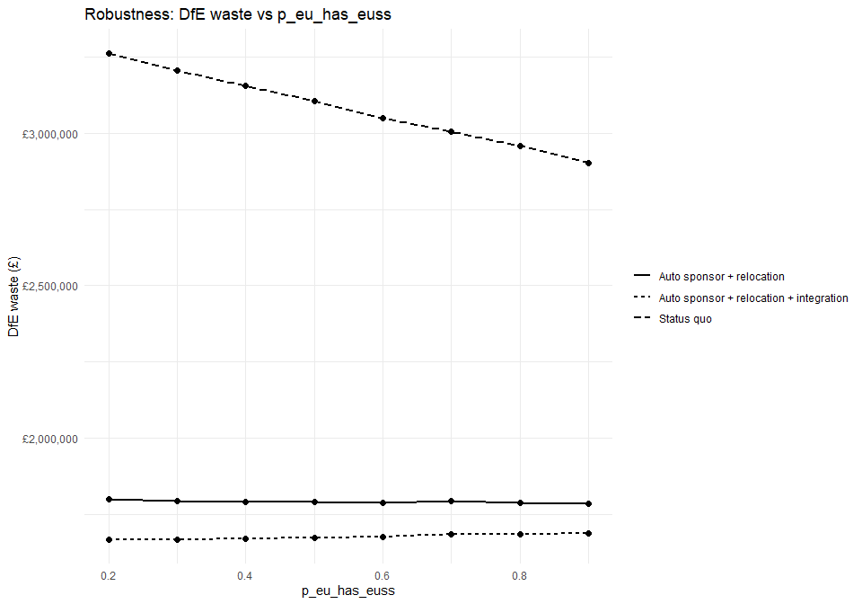

``` r
df <- robust_means |>
  dplyr::filter(metric == "total_teacher_waste")

plot_line(
  df,
  ylab = "Teacher waste (£)",
  title = "Robustness: teacher waste vs p_eu_has_euss",
  y_formatter = pound
)
```

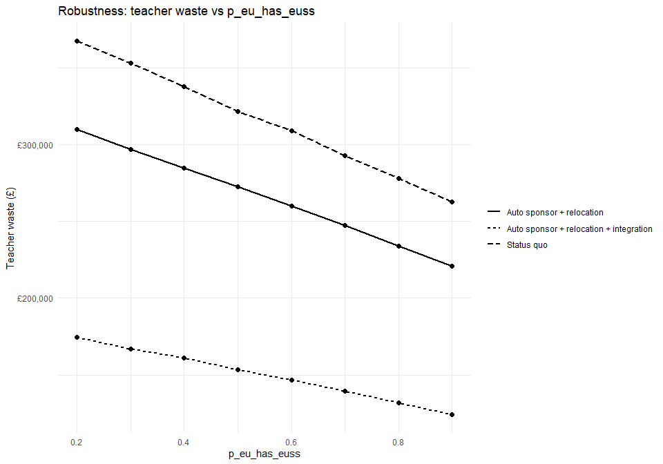

``` r
df <- robust_means |>
  dplyr::filter(metric == "total_system_waste")

plot_line(
  df,
  ylab = "System waste (£)",
  title = "Robustness: system waste vs p_eu_has_euss",
  y_formatter = pound
)
```

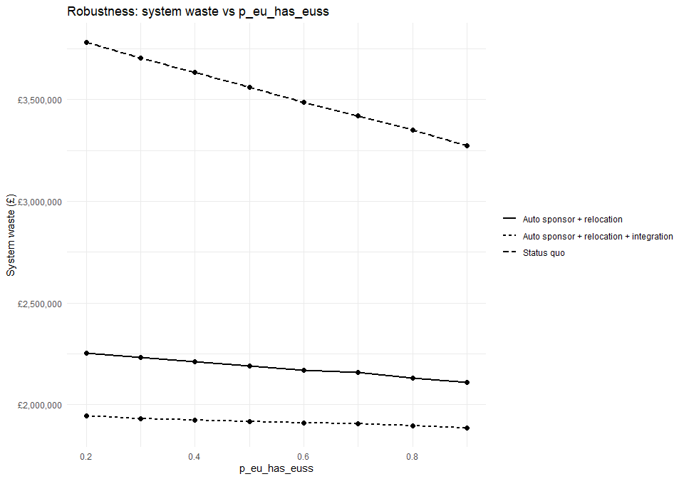

``` r
df <- robust_means |>
  dplyr::filter(metric == "waste_per_retained")

plot_line(
  df,
  ylab = "Waste per retained teacher (£)",
  title = "Robustness: waste per retained vs p_eu_has_euss",
  y_formatter = pound
)
```

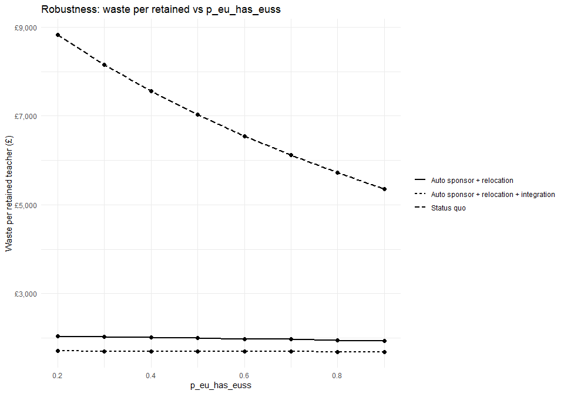

``` r
# ============================================================
# Appendix B — Robustness: sweep p_eu_has_euss (R=5000)
# Focus: DfE waste among non-visa candidates only: dfe_waste[!needs_visa]
# ============================================================

stopifnot(
  exists("generate_potential_overseas"),
  exists("add_training_and_offers"),
  exists("assign_training_incentives"),
  exists("apply_policy_and_score"),
  exists("policy_A"),
  exists("policy_B"),
  exists("policy_C"),
  exists("probs_overseas_group"),
  exists("probs_subject_overseas"),
  exists("probs_degree_overseas_all"),
  exists("params"),
  exists("cache_path"),
  exists("csv_schema_matches")
)

R <- 5000
N0 <- 2000
p_grid <- seq(0.2, 0.9, by = 0.1)

robustB_file <- cache_path(paste0("robust_nonvisa_dfe_waste_R", R))
robustB_required_cols <- c("p_eu_has_euss","policy_id","policy_short","metric","n","mean","sd","mcse")

policy_map <- tibble::tibble(
  policy = c(policy_A$name, policy_B$name, policy_C$name),
  policy_id = c("A", "B", "C"),
  policy_short = c("Status quo", "Auto sponsor + relocation", "Auto sponsor + relocation + integration")
)

mc_summarise <- function(x) {
  x <- x[is.finite(x)]
  n <- length(x)
  if (n == 0) return(tibble::tibble(n = 0L, mean = NA_real_, sd = NA_real_, mcse = NA_real_))
  m <- mean(x)
  s <- stats::sd(x)
  tibble::tibble(n = n, mean = m, sd = s, mcse = s / sqrt(n))
}

run_one_rep_B <- function(rep_id, p_eu, N0 = 2000, params = params) {

  potential <- generate_potential_overseas(
    n = N0,
    probs_overseas_group = probs_overseas_group,
    probs_subject_overseas = probs_subject_overseas,
    probs_degree_overseas_all = probs_degree_overseas_all,
    p_eu_has_euss = p_eu,
    prob_exceptional = params$prob_exceptional
  )

  pipeline <- add_training_and_offers(
    df_potential = potential,
    capacity_posts = params$capacity_posts,
    u_qual = runif(nrow(potential)),
    seed_offer = 777 + rep_id
  ) |>
    assign_training_incentives(params = params)

  n_pipe <- nrow(pipeline)
  u_sponsor_all <- runif(n_pipe)
  u_retention_all <- runif(n_pipe)
  u_integration_all <- runif(n_pipe)

  res_A <- apply_policy_and_score(
    df_pipeline = pipeline,
    policy = policy_A,
    relocation_subjects = params$relocation_subjects,
    u_integration = u_integration_all,
    u_sponsor = u_sponsor_all,
    u_retention = u_retention_all,
    params = params
  )$summary

  res_B <- apply_policy_and_score(
    df_pipeline = pipeline,
    policy = policy_B,
    relocation_subjects = params$relocation_subjects,
    u_integration = u_integration_all,
    u_sponsor = u_sponsor_all,
    u_retention = u_retention_all,
    params = params
  )$summary

  res_C <- apply_policy_and_score(
    df_pipeline = pipeline,
    policy = policy_C,
    relocation_subjects = params$relocation_subjects,
    u_integration = u_integration_all,
    u_sponsor = u_sponsor_all,
    u_retention = u_retention_all,
    params = params
  )$summary

  dplyr::bind_rows(res_A, res_B, res_C) |>
    dplyr::mutate(
      rep = rep_id,
      p_eu_has_euss = p_eu,
      total_system_waste = total_dfe_waste + total_school_waste + total_teacher_waste,
      retained_year1 = n_recruited * (1 - attrition_rate_year1),
      waste_per_retained = total_system_waste / pmax(retained_year1, 1)
    ) |>
    dplyr::left_join(policy_map, by = "policy") |>
    dplyr::select(p_eu_has_euss, rep, policy_id, policy_short, dplyr::everything())
}

if (csv_schema_matches(robustB_file, robustB_required_cols)) {

  robustB <- readr::read_csv(robustB_file, show_col_types = FALSE)
  cat("Loaded cached ", robustB_file, "\n", sep = "")

} else {

  set.seed(20250119)

  out_list <- vector("list", length(p_grid))

  for (i in seq_along(p_grid)) {

    p_val <- p_grid[i]

    res_list <- vector("list", R)
    for (r in seq_len(R)) {
      res_list[[r]] <- run_one_rep_B(r, p_val, N0 = N0, params = params)
    }

    mc <- dplyr::bind_rows(res_list)

    metrics <- c(
      "recruitment_rate",
      "recruited_over_capacity",
      "attrition_rate_year1",
      "share_needs_visa_among_recruited",
      "total_dfe_waste_nonvisa",
      "total_system_waste",
      "waste_per_retained"
    )
    metrics <- intersect(metrics, names(mc))

    summ <- mc |>
      dplyr::select(p_eu_has_euss, policy_id, policy_short, dplyr::all_of(metrics)) |>
      tidyr::pivot_longer(cols = dplyr::all_of(metrics), names_to = "metric", values_to = "value") |>
      dplyr::group_by(p_eu_has_euss, policy_id, policy_short, metric) |>
      dplyr::group_modify(~ mc_summarise(.x$value)) |>
      dplyr::ungroup()

    out_list[[i]] <- summ
  }

  robustB <- dplyr::bind_rows(out_list)
  readr::write_csv(robustB, robustB_file)
  cat("Ran robustness sweep and cached ", robustB_file, "\n", sep = "")
}
```

    ## Loaded cached cache/robust_nonvisa_dfe_waste_R5000_v4_99ci_ABF_parallel_20260425.csv

``` r
robustB_means <- robustB |>
  dplyr::select(p_eu_has_euss, policy_short, metric, mean)
```

``` r
df <- robustB_means |>
  dplyr::filter(metric == "total_dfe_waste_nonvisa")

plot_line(
  df,
  ylab = "DfE waste among non-visa candidates (£)",
  title = "Robustness: DfE non-visa waste vs p_eu_has_euss",
  y_formatter = pound
)
```

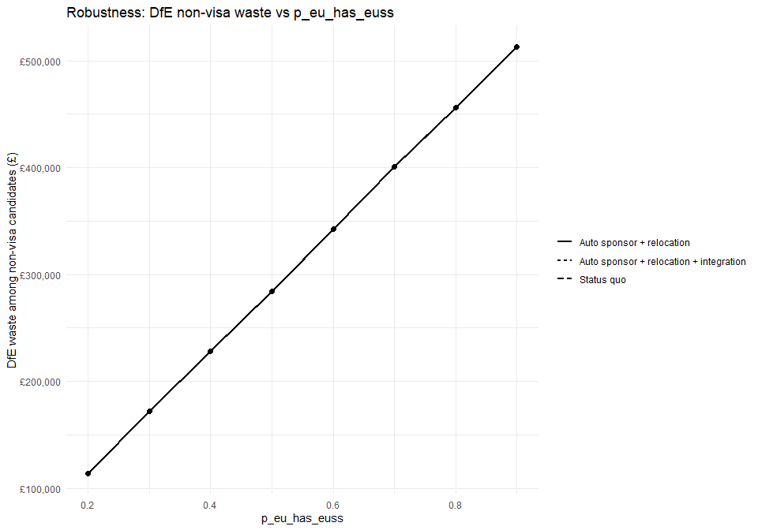

``` r
df <- robustB_means |>
  dplyr::filter(metric == "recruited_over_capacity")

plot_line(
  df,
  ylab = "Recruited / capacity",
  title = "Robustness (Appendix B): recruited over capacity vs p_eu_has_euss",
  y_formatter = scales::percent_format(accuracy = 1)
)
```

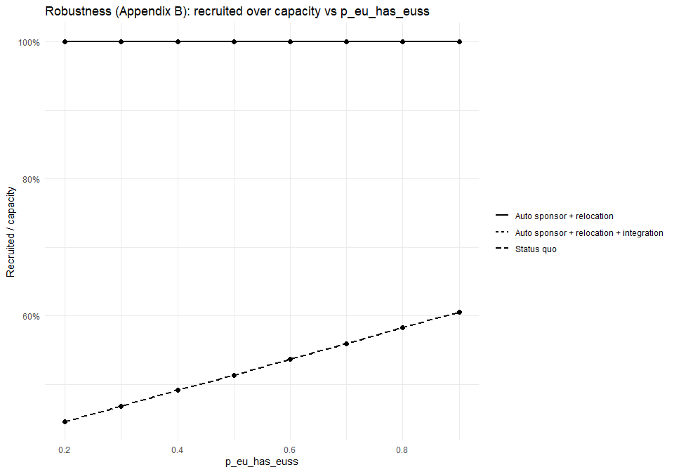

``` r
df <- robustB_means |>
  dplyr::filter(metric == "attrition_rate_year1")

plot_line(
  df,
  ylab = "Attrition rate (year 1)",
  title = "Robustness (Appendix B): year-1 attrition vs p_eu_has_euss",
  y_formatter = scales::percent_format(accuracy = 1)
)
```

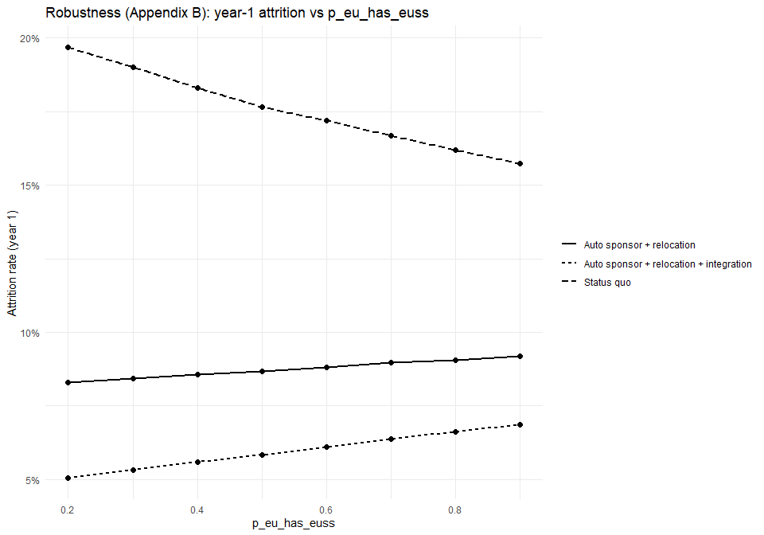

``` r
df <- robustB_means |>
  dplyr::filter(metric == "share_needs_visa_among_recruited")

plot_line(
  df,
  ylab = "Visa-exposed share among recruited",
  title = "Robustness (Appendix B): visa-exposed share vs p_eu_has_euss",
  y_formatter = scales::percent_format(accuracy = 1)
)
```

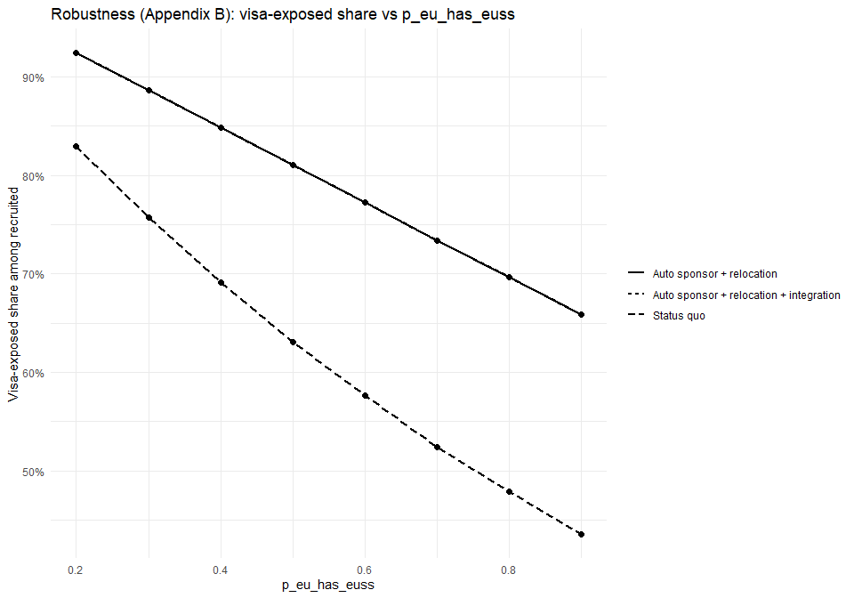

``` r
df <- robustB_means |>
  dplyr::filter(metric == "total_system_waste") |>
  dplyr::mutate(mean = mean / 1e6)

plot_line(
  df,
  ylab = "Total system waste (£m)",
  title = "Robustness (Appendix B): total system waste vs p_eu_has_euss",
  y_formatter = function(x) pound(x, accuracy = 0.01)
)
```

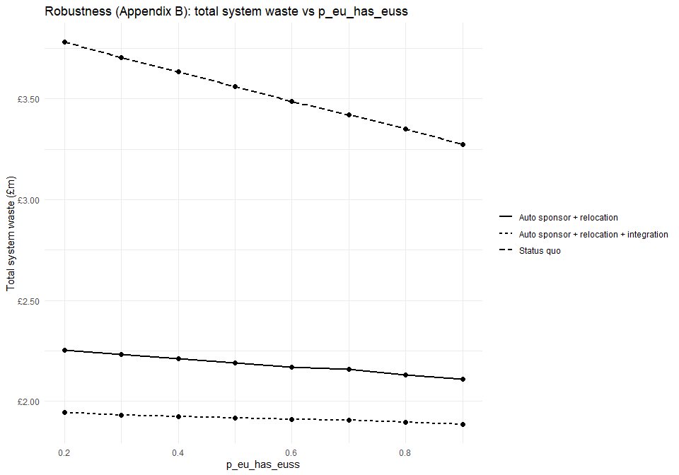

``` r
df <- robustB_means |>
  dplyr::filter(metric == "waste_per_retained")

plot_line(
  df,
  ylab = "Waste per retained teacher (£)",
  title = "Robustness (Appendix B): waste per retained vs p_eu_has_euss",
  y_formatter = function(x) pound(x, accuracy = 0.01)
)
```

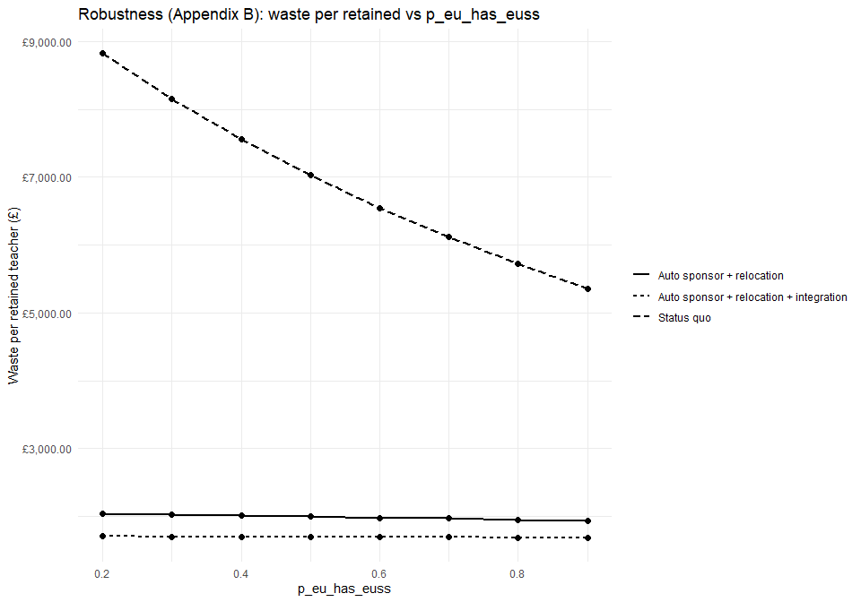

``` r
# ============================================================
# Appendix — Randomness & reproducibility checks (R = 5000 run)
# ============================================================

R_target <- 5000L
mc_path <- cache_path("mc_abc_R5000")

need_cols <- c(
  "rep", "policy_id",
  "n_recruited", "attrition_rate_year1", "share_needs_visa_among_recruited",
  "total_dfe_waste", "total_school_waste", "total_teacher_waste",
  "total_system_waste", "waste_per_retained"
)

if (!csv_schema_matches(mc_path, need_cols)) {
  stop(
    "Missing MC cache or schema mismatch: ", mc_path, "\n",
    "Re-knit Block 4 to regenerate under the current cache_version."
  )
}

mc_abc <- readr::read_csv(mc_path, show_col_types = FALSE)

# -----------------------------
# A1) Integrity checks
# -----------------------------
rep_vals <- sort(unique(mc_abc$rep))

chk_rows <- (nrow(mc_abc) == 3L * R_target)
chk_policy_per_rep <- all(table(mc_abc$rep) == 3L)
chk_rep_range <- (min(rep_vals) == 1) && (max(rep_vals) == R_target) && (length(rep_vals) == R_target)

integrity_tbl <- tibble::tibble(
  check = c("rows == 3*R", "3 policies per rep", "rep covers 1..R"),
  ok = c(chk_rows, chk_policy_per_rep, chk_rep_range)
)

# -----------------------------
# A2) Determinism check: rerun first K reps and compare
# -----------------------------
K_check <- 30L
if (!exists("run_one_replication")) stop("run_one_replication() not found (Block 4 must define it).")

RNGkind("L'Ecuyer-CMRG")
set.seed(20250117)

rerun_list <- vector("list", K_check)
for (r in seq_len(K_check)) {
  rerun_list[[r]] <- run_one_replication(r, N0 = 2000, params = params)
}

keep_cols <- c(
  "rep","policy_id",
  "n_recruited","attrition_rate_year1","share_needs_visa_among_recruited",
  "total_dfe_waste","total_school_waste","total_teacher_waste",
  "total_system_waste","waste_per_retained"
)

mc_rerun <- dplyr::bind_rows(rerun_list) |>
  dplyr::select(dplyr::all_of(keep_cols)) |>
  dplyr::arrange(rep, policy_id) |>
  dplyr::mutate(dplyr::across(where(is.integer), as.double))

mc_saved <- mc_abc |>
  dplyr::filter(rep <= K_check) |>
  dplyr::select(dplyr::all_of(keep_cols)) |>
  dplyr::arrange(rep, policy_id) |>
  dplyr::mutate(dplyr::across(where(is.integer), as.double))

diff_mat <- abs(
  as.matrix(dplyr::select(mc_rerun, -rep, -policy_id)) -
    as.matrix(dplyr::select(mc_saved, -rep, -policy_id))
)

max_abs_diff <- max(diff_mat, na.rm = TRUE)
det_ok <- is.finite(max_abs_diff) && (max_abs_diff < 1e-12)

# -----------------------------
# A3) CRN effectiveness: paired vs unpaired variance
# -----------------------------
wide <- mc_abc |>
  dplyr::select(rep, policy_id, waste_per_retained, total_system_waste, attrition_rate_year1) |>
  tidyr::pivot_wider(
    names_from = policy_id,
    values_from = c(waste_per_retained, total_system_waste, attrition_rate_year1)
  )

d_paired <- wide |>
  dplyr::transmute(
    d_waste_BA = waste_per_retained_B - waste_per_retained_A,
    d_waste_CA = waste_per_retained_C - waste_per_retained_A,
    d_sys_BA = total_system_waste_B - total_system_waste_A,
    d_sys_CA = total_system_waste_C - total_system_waste_A
  )

set.seed(20250117)
perm <- sample.int(nrow(wide))

d_unpaired <- tibble::tibble(
  d_waste_BA = wide$waste_per_retained_B - wide$waste_per_retained_A[perm],
  d_waste_CA = wide$waste_per_retained_C - wide$waste_per_retained_A[perm],
  d_sys_BA = wide$total_system_waste_B - wide$total_system_waste_A[perm],
  d_sys_CA = wide$total_system_waste_C - wide$total_system_waste_A[perm]
)

var_ratio <- tibble::tibble(
  contrast = names(d_paired),
  var_paired = vapply(d_paired, stats::var, numeric(1), na.rm = TRUE),
  var_unpaired = vapply(d_unpaired, stats::var, numeric(1), na.rm = TRUE),
  ratio_unpaired_over_paired = var_unpaired / var_paired
)

checks_tbl <- dplyr::bind_rows(
  integrity_tbl,
  tibble::tibble(check = paste0("determinism: rerun matches saved (K=", K_check, ", max|Δ|<1e-12)"), ok = det_ok),
  tibble::tibble(check = "CRN reduces variance (all ratios > 1)", ok = all(var_ratio$ratio_unpaired_over_paired > 1))
)

print(checks_tbl)
```

    ## # A tibble: 5 × 2
    ##   check                                                 ok   
    ##   <chr>                                                 <lgl>
    ## 1 rows == 3*R                                           TRUE 
    ## 2 3 policies per rep                                    TRUE 
    ## 3 rep covers 1..R                                       TRUE 
    ## 4 determinism: rerun matches saved (K=30, max|Δ|<1e-12) FALSE
    ## 5 CRN reduces variance (all ratios > 1)                 TRUE

``` r
cat("Determinism max absolute difference:", signif(max_abs_diff, 6), "\n")
```

    ## Determinism max absolute difference: 890910

``` r
print(var_ratio)
```

    ## # A tibble: 4 × 4
    ##   contrast     var_paired  var_unpaired ratio_unpaired_over_paired
    ##   <chr>             <dbl>         <dbl>                      <dbl>
    ## 1 d_waste_BA      243397.       407356.                       1.67
    ## 2 d_waste_CA      256222.       402162.                       1.57
    ## 3 d_sys_BA   39427279479. 127606262115.                       3.24
    ## 4 d_sys_CA   41619514143. 124417835716.                       2.99

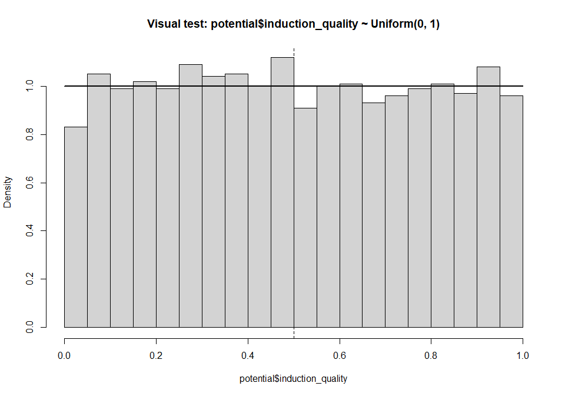

    ## 
    ## [Moment matching] sample vs theory for potential$induction_quality

    ##   mean(sim) = 0.499988 | E[X] = 0.5 | abs diff = 1.22814e-05

    ##   var(sim)  = 0.082082 | Var[X] = 0.0833333 | abs diff = 0.00125132

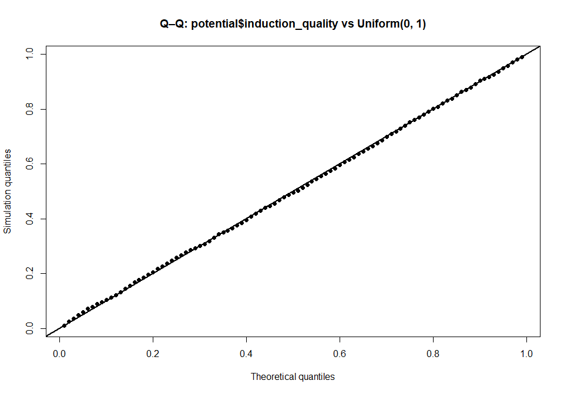

    ## 
    ## [Q–Q tail check] abs deviation at probs {0.01,0.05,0.95,0.99}:

    ##      p=0.01      p=0.05      p=0.95      p=0.99 
    ## 0.000532119 0.009727100 0.001547410 0.000244193

``` r
# ============================================================
# Robustness post-check (NO re-simulation)
# Reads Appendix A cache and checks directional sanity.
# ============================================================

stopifnot(exists("cache_path"), exists("csv_schema_matches"))
suppressPackageStartupMessages({
  library(dplyr); library(readr); library(tidyr)
})

robust_file <- cache_path("robust_p_eu_has_euss_R5000")

robust_required_cols <- c("p_eu_has_euss","policy_id","policy_short","metric","n","mean","sd","mcse")
if (!csv_schema_matches(robust_file, robust_required_cols)) {
  stop("Robustness cache missing or schema mismatch: ", robust_file)
}

robust <- readr::read_csv(robust_file, show_col_types = FALSE)

# Expected directional checks (rank-based, tolerant to small MC noise)
spearman_by <- robust %>%
  filter(metric %in% c(
    "share_needs_visa_among_recruited",
    "recruitment_rate",
    "total_teacher_waste",
    "waste_per_retained"
  )) %>%
  group_by(policy_id, policy_short, metric) %>%
  summarise(
    rho = suppressWarnings(cor(p_eu_has_euss, mean, method = "spearman")),
    .groups = "drop"
  )

# Rules of thumb (adapt if your narrative changes):
# - visa share should DECREASE as p_eu_has_euss increases => rho negative
visa_rho <- spearman_by %>%
  filter(metric == "share_needs_visa_among_recruited") %>%
  mutate(ok = is.finite(rho) & rho < -0.2)

# - recruitment_rate under Status Quo should generally INCREASE with p_eu_has_euss
recruit_rho <- spearman_by %>%
  filter(metric == "recruitment_rate") %>%
  mutate(ok = if_else(policy_id == "A", is.finite(rho) & rho > 0.2, TRUE))

# - teacher waste should generally DECREASE with p_eu_has_euss (less visa exposure)
teacher_waste_rho <- spearman_by %>%
  filter(metric == "total_teacher_waste") %>%
  mutate(ok = is.finite(rho) & rho < -0.1)

postcheck <- bind_rows(
  visa_rho %>% mutate(check = "Visa share decreases with p_eu_has_euss"),
  recruit_rho %>% mutate(check = "Recruitment (Status Quo) increases with p_eu_has_euss"),
  teacher_waste_rho %>% mutate(check = "Teacher waste decreases with p_eu_has_euss")
) %>%
  select(check, policy_id, policy_short, metric, rho, ok) %>%
  arrange(check, policy_id)

print(postcheck)
```

    ## # A tibble: 9 × 6
    ##   check                                policy_id policy_short metric   rho ok   
    ##   <chr>                                <chr>     <chr>        <chr>  <dbl> <lgl>
    ## 1 Recruitment (Status Quo) increases … A         Status quo   recru…     1 TRUE 
    ## 2 Recruitment (Status Quo) increases … B         Auto sponso… recru…    NA TRUE 
    ## 3 Recruitment (Status Quo) increases … C         Auto sponso… recru…    NA TRUE 
    ## 4 Teacher waste decreases with p_eu_h… A         Status quo   total…    -1 TRUE 
    ## 5 Teacher waste decreases with p_eu_h… B         Auto sponso… total…    -1 TRUE 
    ## 6 Teacher waste decreases with p_eu_h… C         Auto sponso… total…    -1 TRUE 
    ## 7 Visa share decreases with p_eu_has_… A         Status quo   share…    -1 TRUE 
    ## 8 Visa share decreases with p_eu_has_… B         Auto sponso… share…    -1 TRUE 
    ## 9 Visa share decreases with p_eu_has_… C         Auto sponso… share…    -1 TRUE

``` r
if (any(postcheck$ok == FALSE)) {
  warning("Some robustness directional checks failed. Inspect curves + MCSEs.")
} else {
  cat("✔ Robustness post-check: directional sanity looks consistent.\n")
}
```

    ## ✔ Robustness post-check: directional sanity looks consistent.
